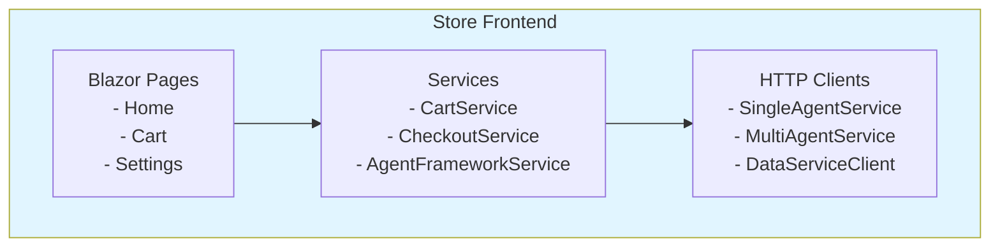
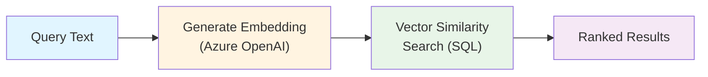
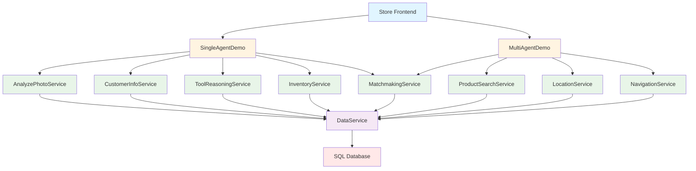

# BRK445 Component Architecture

## Overview

This document provides detailed descriptions of all components in the BRK445 solution, organized by architectural layer.

## Related Documentation

- [General Architecture](./ARCHITECTURE_GENERAL.md) - Architectural principles and patterns
- [Single Agent Data Flow](./ARCHITECTURE_DATAFLOW_SINGLE.md) - SingleAgentDemo execution patterns
- [Multi Agent Data Flow](./ARCHITECTURE_DATAFLOW_MULTI.md) - MultiAgentDemo orchestration patterns
- [Deployment Guide](./ARCHITECTURE_DEPLOYMENT.md) - Deployment details

## Component Layers

### Layer 1: Presentation Layer

#### Store (Blazor Frontend)

**Technology**: Blazor Server (.NET 9)

**Location**: `src/Store/`

**Responsibilities**:
- Interactive user interface for retail experience
- Shopping cart management
- Agent mode configuration
- Integration with demo services
- DevUI for agent debugging (development only)

**Key Features**:
- Agent mode preference stored in browser `localStorage`
- Dynamic routing to MAF Local, MAF Foundry, or Direct Call modes
- Integration with Microsoft.Agents.AI DevUI for debugging
- Blazor Bootstrap for UI components

**Configuration**:
```csharp
// Program.cs
builder.Services.AddHttpClient<SingleAgentService>(
    static client => client.BaseAddress = new("https+http://singleagentdemo"));
    
builder.Services.AddHttpClient<MultiAgentService>(
    static client => client.BaseAddress = new("https+http://multiagentdemo"));
```

**Component Diagram**:

```
┌────────────────────────────────────────────────────┐
│              Store (Blazor Server)                  │
├────────────────────────────────────────────────────┤
│                                                     │
│  ┌──────────────┐  ┌──────────────┐               │
│  │   Blazor     │  │   Services   │               │
│  │  Components  │  │              │               │
│  │              │  │ - CartService│               │
│  │ - Pages      │  │ - CheckoutSvc│               │
│  │ - Layout     │  │ - AgentSvc   │               │
│  │ - Shared     │  │ - SingleAgent│               │
│  └──────────────┘  │ - MultiAgent │               │
│                     └──────────────┘               │
│                                                     │
│  ┌──────────────────────────────────────────────┐ │
│  │         HTTP Clients                          │ │
│  │  - SingleAgentDemo                           │ │
│  │  - MultiAgentDemo                            │ │
│  │  - DataService                               │ │
│  └──────────────────────────────────────────────┘ │
└────────────────────────────────────────────────────┘
```



---

### Layer 2: Agent Orchestration Layer

#### SingleAgentDemo

**Technology**: ASP.NET Core Web API (.NET 9)

**Location**: `src/SingleAgentDemo/`

**Pattern**: Single agent with reasoning loop

**Responsibilities**:
- Orchestrate single-agent workflow
- Coordinate tool calls across agent services
- Provide MAF Local and MAF Foundry modes
- Return structured recommendations

**Workflow**:
1. Analyze customer photo
2. Retrieve customer information
3. Determine appropriate tools via reasoning
4. Query inventory for matching products
5. Return personalized recommendations

**Endpoints**:
```
/api/singleagent/local/*       → MAF Local mode
/api/singleagent/foundry/*     → MAF Foundry mode
/api/singleagent/directcall/*  → Direct call mode (no AI)
```

**Configuration**:
```csharp
// Register MAF Foundry agents
builder.AddMAFFoundryAgents(microsoftFoundryProjectConnection);

// Register MAF Local agents
builder.AddMAFLocalAgents();

// Register HTTP clients for agent services
builder.Services.AddHttpClient<ToolReasoningService>(
    static client => client.BaseAddress = new("http+https://toolreasoningservice"));
```

**Use Cases**:
- Workflow-oriented tasks where one agent can reason through multiple steps
- Tasks requiring tool selection and sequential execution
- Personalized product recommendations

#### MultiAgentDemo

**Technology**: ASP.NET Core Web API (.NET 9)

**Location**: `src/MultiAgentDemo/`

**Pattern**: Multiple specialized agents coordinated sequentially

**Responsibilities**:
- Orchestrate multi-agent collaboration
- Execute agents in sequence
- Aggregate results from specialized agents
- Provide comprehensive responses

**Workflow**:
1. Product Search Agent → Find candidate products
2. Matchmaking Agent → Evaluate matches with customer preferences
3. Navigation Agent → Generate in-store route instructions

**Endpoints**:
```
/api/multiagent/local/*       → MAF Local mode
/api/multiagent/foundry/*     → MAF Foundry mode
/api/multiagent/directcall/*  → Direct call mode (no AI)
```

**Configuration**:
```csharp
// Register MAF agents
builder.AddMAFFoundryAgents(microsoftFoundryProjectConnection);
builder.AddMAFLocalAgents();

// Add workflows for complex orchestration
builder.AddMAFLocalWorkflows();

// Register orchestration services
builder.Services.AddScoped<ProductSearchOrchestrator>();
builder.Services.AddScoped<MatchmakingOrchestrator>();
builder.Services.AddScoped<NavigationOrchestrator>();
```

**Use Cases**:
- Complex domain-specific tasks requiring specialized agents
- Multi-step processes with clear stage boundaries
- Tasks benefiting from agent specialization

---

### Layer 3: Agent Services Layer

Each agent service follows a consistent architectural pattern:

#### Service Structure

```
[AgentName]Service/
├── Controllers/
│   └── [Agent]Controller.cs      # HTTP endpoints
├── Program.cs                     # Service configuration
└── [AgentName]Service.csproj     # Dependencies
```

#### Common Service Pattern

All agent services implement:

1. **MAF Foundry Mode**: Uses Microsoft Foundry deployed agents
2. **MAF Local Mode**: Uses locally created agents with IChatClient
3. **Direct Call Mode**: Returns mock responses without AI

**Standard Configuration**:
```csharp
// Program.cs pattern for all agent services
var builder = WebApplication.CreateBuilder(args);
builder.AddServiceDefaults();

// Register MAF Foundry agents
var foundryConnection = builder.Configuration.GetConnectionString("microsoftfoundryproject");
builder.AddMAFFoundryAgents(foundryConnection);

// Register MAF Local agents
builder.AddAzureOpenAIClient(connectionName: "microsoftfoundrycnnstring")
    .AddChatClient(chatDeploymentName);
builder.AddMAFLocalAgents();

// Add DataServiceClient for data access
builder.Services.AddDataServiceClient("https+http://dataservice");
```

#### Agent Services Catalog

##### 1. AnalyzePhotoService

**Purpose**: Analyze customer photos using vision AI

**Location**: `src/AnalyzePhotoService/`

**Tools Provided**:
- Image analysis using Azure Computer Vision
- Customer preference detection
- Visual feature extraction

**Endpoints**:
- `POST /api/photoanalysis/local/analyze` - MAF Local mode
- `POST /api/photoanalysis/foundry/analyze` - MAF Foundry mode
- `POST /api/photoanalysis/analyzedirectcall` - Direct call mode

**Dependencies**:
- Microsoft.Agents.AI
- Azure OpenAI Client
- DataService

##### 2. CustomerInformationService

**Purpose**: Retrieve and manage customer data

**Location**: `src/CustomerInformationService/`

**Tools Provided**:
- Customer profile retrieval
- Purchase history access
- Preference management

**Endpoints**:
- `POST /api/customer/local/getinfo` - MAF Local mode
- `POST /api/customer/foundry/getinfo` - MAF Foundry mode
- `POST /api/customer/getinfodirectcall` - Direct call mode

**Dependencies**:
- Microsoft.Agents.AI
- DataService
- SQL Database

##### 3. ToolReasoningService

**Purpose**: Analyze context and select appropriate tools

**Location**: `src/ToolReasoningService/`

**Tools Provided**:
- Tool selection reasoning
- Context analysis
- Capability matching

**Endpoints**:
- `POST /api/reasoning/local/analyze` - MAF Local mode
- `POST /api/reasoning/foundry/analyze` - MAF Foundry mode
- `POST /api/reasoning/analyzedirectcall` - Direct call mode

**Dependencies**:
- Microsoft.Agents.AI
- DataService

##### 4. InventoryService

**Purpose**: Search and query product inventory

**Location**: `src/InventoryService/`

**Tools Provided**:
- Product availability checking
- Inventory filtering
- Stock level queries

**Endpoints**:
- `POST /api/inventory/local/search` - MAF Local mode
- `POST /api/inventory/foundry/search` - MAF Foundry mode
- `POST /api/inventory/searchdirectcall` - Direct call mode

**Dependencies**:
- Microsoft.Agents.AI
- DataService
- SQL Database

##### 5. MatchmakingService

**Purpose**: Match products with customer preferences

**Location**: `src/MatchmakingService/`

**Tools Provided**:
- Similarity scoring
- Preference matching
- Product ranking

**Endpoints**:
- `POST /api/matchmaking/local/match` - MAF Local mode
- `POST /api/matchmaking/foundry/match` - MAF Foundry mode
- `POST /api/matchmaking/matchdirectcall` - Direct call mode

**Dependencies**:
- Microsoft.Agents.AI
- DataService
- Vector search capabilities

##### 6. LocationService

**Purpose**: Find product locations in store

**Location**: `src/LocationService/`

**Tools Provided**:
- Store zone mapping
- Aisle location lookup
- Product placement information

**Endpoints**:
- `POST /api/location/local/find` - MAF Local mode
- `POST /api/location/foundry/find` - MAF Foundry mode
- `POST /api/location/finddirectcall` - Direct call mode

**Dependencies**:
- Microsoft.Agents.AI
- DataService

##### 7. NavigationService

**Purpose**: Generate in-store navigation instructions

**Location**: `src/NavigationService/`

**Tools Provided**:
- Pathfinding algorithms
- Turn-by-turn directions
- Landmark identification

**Endpoints**:
- `POST /api/navigation/local/route` - MAF Local mode
- `POST /api/navigation/foundry/route` - MAF Foundry mode
- `POST /api/navigation/routedirectcall` - Direct call mode

**Dependencies**:
- Microsoft.Agents.AI
- DataService
- LocationService

**Data Models**:
```csharp
public record NavigationInstructions(
    NavigationStep[] Steps,
    string Summary
);

public record NavigationStep(
    string Direction,
    string Description,
    string Landmark
);
```

##### 8. ProductSearchService

**Purpose**: Semantic search for products

**Location**: `src/ProductSearchService/`

**Tools Provided**:
- Vector similarity search
- Semantic query understanding
- Product ranking by relevance

**Endpoints**:
- `POST /api/productsearch/local/search` - MAF Local mode
- `POST /api/productsearch/foundry/search` - MAF Foundry mode
- `POST /api/productsearch/searchdirectcall` - Direct call mode

**Dependencies**:
- Microsoft.Agents.AI
- DataService
- Embedding generation
- Vector search

---

### Layer 4: Data Services Layer

#### DataService

**Technology**: ASP.NET Core Web API + Entity Framework Core (.NET 9)

**Location**: `src/DataService/`

**Responsibilities**:
- SQL Server database access
- Product catalog management
- Semantic search with embeddings
- Vector memory for similarity

**Key Features**:
- Automatic database initialization with seed data
- Embedding generation using Azure OpenAI
- Vector search for semantic recommendations
- RESTful endpoints for CRUD operations

**Database Schema**:
```
Products Table:
- Id (int, PK)
- Name (nvarchar)
- Description (nvarchar)
- Price (decimal)
- Category (nvarchar)
- Zone (nvarchar)
- Aisle (nvarchar)
- ImageUrl (nvarchar)
- Embedding (vector)

Customers Table:
- Id (int, PK)
- Name (nvarchar)
- Email (nvarchar)
- Preferences (nvarchar)
- PurchaseHistory (nvarchar)
```

**Endpoints**:
```
GET  /products              - List all products
GET  /products/{id}         - Get product by ID
POST /products/search       - Semantic search
POST /products/similar      - Find similar products
GET  /data/initialize       - Initialize/reset database
```

**Configuration**:
```csharp
// Database context
builder.AddSqlServerDbContext<Context>("productsDb");

// Azure OpenAI for embeddings
builder.AddAzureOpenAIClient(connectionName: "microsoftfoundrycnnstring")
    .AddEmbeddingGenerator(embeddingsDeploymentName);

// Memory context for vector search
builder.Services.AddSingleton<MemoryContext>();
```

**Vector Search Flow**:
```
Query Text
    ↓
Generate Embedding (Azure OpenAI)
    ↓
Vector Similarity Search (SQL)
    ↓
Ranked Results
```



---

### Layer 5: Infrastructure Layer

#### Microsoft Foundry (AI Services)

**Resource Type**: `Microsoft.CognitiveServices/accounts` (kind: 'AIServices')

**Purpose**:
- Host deployed AI agents
- Provide chat models (gpt-5-mini)
- Provide embedding models (text-embedding-3-small)
- Centralized AI capabilities

**Configuration**:
```json
{
  "ConnectionStrings": {
    "microsoftfoundryproject": "Endpoint=https://[resource].cognitiveservices.azure.com/;Key=[key]",
    "microsoftfoundrycnnstring": "Endpoint=https://[resource].openai.azure.com/;Key=[key]"
  }
}
```

#### SQL Server Database

**Resource Type**: `Microsoft.Sql/servers` with `Microsoft.Sql/servers/databases`

**SKU**: Basic tier (5 DTU)

**Purpose**:
- Store product catalog
- Manage customer data
- Vector storage for embeddings
- Relational data queries

**Features**:
- Automatic initialization via Entity Framework migrations
- Seed data for demo scenarios
- Firewall rule to allow Azure services

#### Application Insights

**Resource Type**: `Microsoft.Insights/components`

**Purpose**:
- Application telemetry
- Performance monitoring
- Error tracking
- Distributed tracing

**Collected Metrics**:
- Request/response times
- Dependency call durations
- Exception rates
- Custom agent metrics

#### Storage Account

**Resource Type**: `Microsoft.Storage/storageAccounts`

**SKU**: Standard_LRS

**Purpose**:
- Blob storage for images
- File storage for assets
- Queue storage for async processing (future)

---

## Service Communication

### Aspire Service Discovery

Services communicate using Aspire's service discovery mechanism:

```csharp
// Service reference in ZavaAppHost/Program.cs
var dataservice = builder.AddProject<Projects.DataService>("dataservice");
var analyzePhotoService = builder.AddProject<Projects.AnalyzePhotoService>("analyzephotoservice")
    .WithReference(dataservice);

// HTTP client in consuming service
builder.Services.AddHttpClient<IProductService, ProductService>(
    static client => client.BaseAddress = new("https+http://dataservice"));
```

**DNS Resolution**: `https+http://[servicename]` is resolved by Aspire at runtime to the actual service endpoint.

### Service Dependency Graph

```
Store
├── SingleAgentDemo
│   ├── AnalyzePhotoService → DataService
│   ├── CustomerInformationService → DataService
│   ├── ToolReasoningService → DataService
│   ├── InventoryService → DataService
│   └── MatchmakingService → DataService
│
└── MultiAgentDemo
    ├── ProductSearchService → DataService
    ├── MatchmakingService → DataService
    ├── LocationService → DataService
    └── NavigationService → DataService
```



## Shared Libraries

### ZavaAgentsMetadata

**Purpose**: Centralized agent metadata and naming

**Location**: `src/ZavaAgentsMetadata/`

**Usage**:
```csharp
var agentId = AgentMetadata.GetAgentName(AgentType.NavigationAgent);
```

### ZavaMAFFoundry

**Purpose**: Microsoft Foundry agent provider

**Location**: `src/ZavaMAFFoundry/`

**Extension Method**:
```csharp
builder.AddMAFFoundryAgents(connectionString);
```

### ZavaMAFLocal

**Purpose**: Local agent provider with IChatClient

**Location**: `src/ZavaMAFLocal/`

**Extension Method**:
```csharp
builder.AddMAFLocalAgents();
```

### ZavaDatabaseInitialization

**Purpose**: Database initialization and seeding

**Location**: `src/ZavaDatabaseInitialization/`

**Classes**:
- `Context`: Entity Framework DbContext
- `DbInitializer`: Database initialization logic

### ZavaServiceDefaults

**Purpose**: Common service configurations

**Location**: `src/ZavaServiceDefaults/`

**Extension Method**:
```csharp
builder.AddServiceDefaults(); // Adds telemetry, health checks, etc.
```

### SharedEntities

**Purpose**: Common data models

**Location**: `src/SharedEntities/`

**Models**:
- `Location`: Store location (Zone, Aisle)
- `NavigationStep`: Navigation instruction
- `NavigationInstructions`: Complete route

### DataServiceClient

**Purpose**: Typed client for DataService

**Location**: `src/DataServiceClient/`

**Extension Method**:
```csharp
builder.Services.AddDataServiceClient("https+http://dataservice");
```

## References

- [General Architecture](./ARCHITECTURE_GENERAL.md) - Architectural principles
- [Single Agent Data Flow](./ARCHITECTURE_DATAFLOW_SINGLE.md) - SingleAgentDemo flow
- [Multi Agent Data Flow](./ARCHITECTURE_DATAFLOW_MULTI.md) - MultiAgentDemo flow
- [Deployment Guide](./ARCHITECTURE_DEPLOYMENT.md) - Deployment instructions

---

**Version**: 2.0  
**Date**: December 2024  
**Authors**: Bruno Capuano, Kinfey Lo  
**Session**: Microsoft AI Tour 2026 - BRK445
