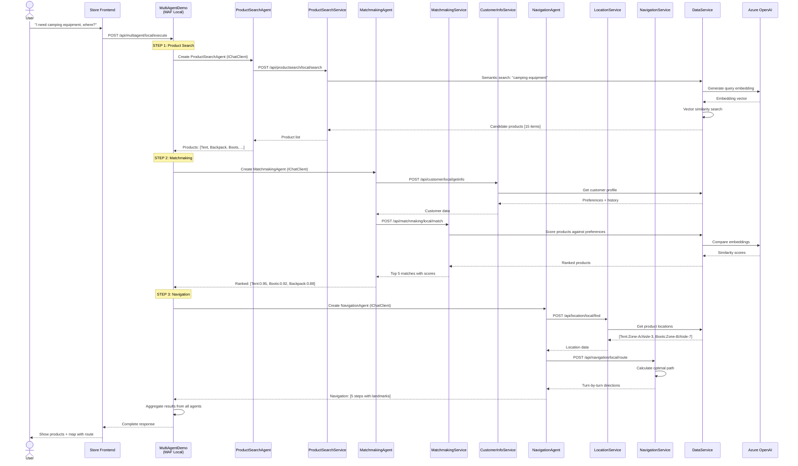
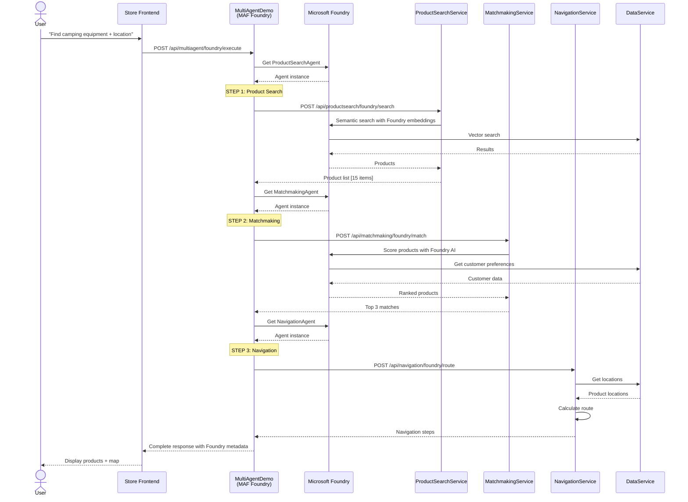
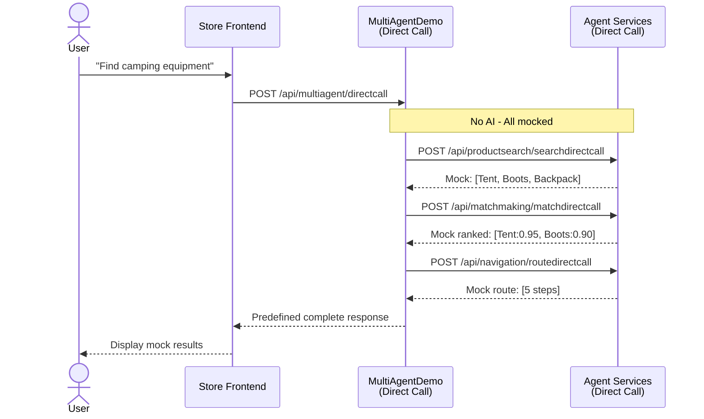

# BRK445 Multi Agent Data Flow

## Overview

This document details the data flow and execution patterns for the MultiAgentDemo service, which demonstrates multi-agent orchestration. Multiple specialized agents work sequentially to search products, match them with customer preferences, and generate in-store navigation instructions.

## Related Documentation

- [General Architecture](./ARCHITECTURE_GENERAL.md) - Architectural principles and patterns
- [Component Architecture](./ARCHITECTURE_COMPONENTS.md) - Component descriptions
- [Single Agent Data Flow](./ARCHITECTURE_DATAFLOW_SINGLE.md) - SingleAgentDemo patterns
- [Deployment Guide](./ARCHITECTURE_DEPLOYMENT.md) - Deployment instructions

## Operating Modes

MultiAgentDemo supports three operating modes, executed in this order:

1. **MAF Local Mode** - Agents created locally with IChatClient
2. **MAF Foundry Mode** - Agents deployed in Microsoft Foundry
3. **Direct Call Mode** - No AI, returns mock responses

## MAF Local Mode Data Flow

### Overview

In MAF Local mode, multiple specialized agents are created locally using `IChatClient` and coordinated sequentially to accomplish a complex task.

### Architecture

```
┌──────────┐
│  Store   │ User: "I need camping equipment, show me where to find it"
│ Frontend │
└────┬─────┘
     │ HTTP POST
     ▼
┌────────────────────┐
│ MultiAgentDemo     │
│ (MAF Local Mode)   │ /api/multiagent/local/execute
└────┬───────────────┘
     │
     │ Sequential Agent Orchestration
     │
     ▼ STEP 1: Product Search
┌──────────────────────────┐
│ ProductSearchAgent       │
│ (Local IChatClient)      │
└────┬─────────────────────┘
     │
     ├──→ ProductSearchService  /api/productsearch/local/search
     │   └─→ DataService        (semantic search with embeddings)
     │       └─→ Azure OpenAI   (generate query embedding)
     │
     │ Returns: List of candidate products
     │
     ▼ STEP 2: Matchmaking
┌──────────────────────────┐
│ MatchmakingAgent         │
│ (Local IChatClient)      │
└────┬─────────────────────┘
     │
     ├──→ CustomerInfoService   /api/customer/local/getinfo
     │   └─→ DataService        (customer preferences)
     │
     ├──→ MatchmakingService    /api/matchmaking/local/match
     │   └─→ DataService        (similarity scoring)
     │       └─→ Azure OpenAI   (embedding comparison)
     │
     │ Returns: Ranked products with match scores
     │
     ▼ STEP 3: Navigation
┌──────────────────────────┐
│ NavigationAgent          │
│ (Local IChatClient)      │
└────┬─────────────────────┘
     │
     ├──→ LocationService       /api/location/local/find
     │   └─→ DataService        (product locations: zones/aisles)
     │
     ├──→ NavigationService     /api/navigation/local/route
     │   └─→ Pathfinding        (generate turn-by-turn directions)
     │
     │ Returns: Navigation instructions with landmarks
     │
     ▼ Aggregate All Results
┌──────────────────────┐
│ Response to Store    │
│ - Product list       │
│ - Match scores       │
│ - Navigation steps   │
│ - Complete route     │
└──────────────────────┘
```

### Mermaid Diagram



### Detailed Step-by-Step Flow

#### Step 1: Product Search Agent

**Purpose**: Find candidate products matching the query

```
User Query: "I need camping equipment"
    ↓
ProductSearchAgent created with IChatClient
    ↓
Agent calls: POST /api/productsearch/local/search
    ↓
ProductSearchService
    ├─→ Understands intent: "camping equipment"
    ├─→ DataService: Semantic search
    │   ├─→ Azure OpenAI: Generate embedding for "camping equipment"
    │   └─→ SQL: Vector similarity search
    ↓
Returns: [
  { id: 1, name: "Alpine Tent", category: "camping", score: 0.96 },
  { id: 2, name: "Hiking Boots", category: "footwear", score: 0.94 },
  { id: 3, name: "Trail Backpack", category: "bags", score: 0.92 },
  ... 12 more items
]
```

**Request Example**:
```json
{
  "query": "camping equipment",
  "maxResults": 15,
  "filters": {
    "category": ["outdoor", "camping"],
    "priceRange": { "min": 0, "max": 500 }
  }
}
```

**Response Example**:
```json
{
  "products": [
    {
      "id": 1,
      "name": "Alpine Tent",
      "description": "4-person camping tent with rainfly",
      "price": 299.99,
      "category": "camping",
      "zone": "A",
      "aisle": "3",
      "relevanceScore": 0.96
    }
  ],
  "totalResults": 15,
  "queryEmbeddingTime": 245,
  "searchTime": 123
}
```

#### Step 2: Matchmaking Agent

**Purpose**: Evaluate products against customer preferences and rank them

```
Input: Products from Step 1 + Customer ID
    ↓
MatchmakingAgent created with IChatClient
    ↓
Agent calls:
    ├─→ POST /api/customer/local/getinfo
    │   └─→ Get customer: preferences, history, budget
    │
    └─→ POST /api/matchmaking/local/match
        ├─→ Compare each product with preferences
        ├─→ DataService: Embedding similarity
        │   └─→ Azure OpenAI: Compare product vs preference embeddings
        └─→ Calculate match scores
    ↓
Returns: [
  { id: 1, name: "Alpine Tent", matchScore: 0.95, reason: "Matches outdoor preferences" },
  { id: 2, name: "Hiking Boots", matchScore: 0.92, reason: "Previously viewed similar" },
  { id: 3, name: "Trail Backpack", matchScore: 0.88, reason: "Complements other items" }
]
```

**Customer Info Request**:
```json
{
  "customerId": "user123"
}
```

**Customer Info Response**:
```json
{
  "id": "user123",
  "name": "John Doe",
  "preferences": ["outdoor activities", "hiking", "camping"],
  "purchaseHistory": [
    { "productId": 42, "category": "camping", "date": "2023-06" }
  ],
  "budget": { "typical": 150, "max": 500 }
}
```

**Matchmaking Request**:
```json
{
  "products": [1, 2, 3, 4, 5],
  "customerId": "user123",
  "context": {
    "season": "summer",
    "activity": "camping"
  }
}
```

**Matchmaking Response**:
```json
{
  "rankedProducts": [
    {
      "productId": 1,
      "matchScore": 0.95,
      "factors": {
        "preferenceMatch": 0.97,
        "historyMatch": 0.88,
        "budgetFit": 0.92
      },
      "reason": "Strong match with outdoor preferences and camping history"
    }
  ]
}
```

#### Step 3: Navigation Agent

**Purpose**: Generate in-store navigation to product locations

```
Input: Top products from Step 2 (e.g., top 3)
    ↓
NavigationAgent created with IChatClient
    ↓
Agent calls:
    ├─→ POST /api/location/local/find
    │   └─→ DataService: Get store locations for products
    │       └─→ Returns: { productId: 1, zone: "A", aisle: "3" }
    │
    └─→ POST /api/navigation/local/route
        ├─→ Calculate optimal path through store
        ├─→ Identify landmarks for each turn
        └─→ Generate step-by-step directions
    ↓
Returns: {
  steps: [
    { step: 1, direction: "Start at entrance", landmark: "Main doors" },
    { step: 2, direction: "Walk straight 50ft", landmark: "Customer service desk" },
    { step: 3, direction: "Turn right", landmark: "Zone A sign" },
    { step: 4, direction: "Walk to Aisle 3", landmark: "Camping section" },
    { step: 5, direction: "Product on left", landmark: "Alpine Tent display" }
  ],
  totalDistance: "200 feet",
  estimatedTime: "3 minutes"
}
```

**Location Request**:
```json
{
  "productIds": [1, 2, 3]
}
```

**Location Response**:
```json
{
  "locations": [
    { "productId": 1, "name": "Alpine Tent", "zone": "A", "aisle": "3", "shelf": "L2" },
    { "productId": 2, "name": "Hiking Boots", "zone": "B", "aisle": "7", "shelf": "R4" },
    { "productId": 3, "name": "Trail Backpack", "zone": "A", "aisle": "5", "shelf": "L1" }
  ]
}
```

**Navigation Request**:
```json
{
  "startLocation": "entrance",
  "productLocations": [
    { "zone": "A", "aisle": "3" },
    { "zone": "B", "aisle": "7" },
    { "zone": "A", "aisle": "5" }
  ],
  "optimizeRoute": true
}
```

**Navigation Response**:
```json
{
  "route": {
    "steps": [
      {
        "stepNumber": 1,
        "direction": "Start at main entrance",
        "description": "Begin your journey at the main entrance",
        "landmark": "Main entrance doors",
        "distance": "0 ft"
      },
      {
        "stepNumber": 2,
        "direction": "Walk straight ahead",
        "description": "Walk straight for 50 feet",
        "landmark": "Pass customer service desk on your left",
        "distance": "50 ft"
      },
      {
        "stepNumber": 3,
        "direction": "Turn right at Zone A",
        "description": "Turn right when you see the Zone A sign",
        "landmark": "Large Zone A overhead sign",
        "distance": "75 ft"
      },
      {
        "stepNumber": 4,
        "direction": "Proceed to Aisle 3",
        "description": "Walk down Zone A to Aisle 3",
        "landmark": "Camping equipment section",
        "distance": "100 ft"
      },
      {
        "stepNumber": 5,
        "direction": "Product location",
        "description": "Alpine Tent is on the left side, shelf L2",
        "landmark": "Large tent display",
        "distance": "125 ft"
      }
    ],
    "totalDistance": "250 feet",
    "estimatedTime": "4 minutes",
    "productsOnRoute": [
      { "productId": 1, "stopNumber": 1 },
      { "productId": 3, "stopNumber": 2 },
      { "productId": 2, "stopNumber": 3 }
    ]
  }
}
```

#### Step 4: Response Aggregation

```csharp
// MultiAgentDemo aggregates results from all agents
var finalResponse = new {
    products = matchmakingResult.rankedProducts.Take(3),
    navigation = navigationResult,
    summary = GenerateSummary(allResults),
    metadata = new {
        mode = "maf_local",
        agentsUsed = 3,
        totalTime = totalExecutionTime,
        confidence = CalculateConfidence()
    }
};

return finalResponse;
```

**Final Response to Store**:
```json
{
  "products": [
    {
      "id": 1,
      "name": "Alpine Tent",
      "price": 299.99,
      "matchScore": 0.95,
      "location": { "zone": "A", "aisle": "3" }
    },
    {
      "id": 2,
      "name": "Hiking Boots",
      "price": 149.99,
      "matchScore": 0.92,
      "location": { "zone": "B", "aisle": "7" }
    },
    {
      "id": 3,
      "name": "Trail Backpack",
      "price": 89.99,
      "matchScore": 0.88,
      "location": { "zone": "A", "aisle": "5" }
    }
  ],
  "navigation": {
    "steps": [ /* navigation steps */ ],
    "totalDistance": "250 feet",
    "estimatedTime": "4 minutes"
  },
  "summary": "Found 3 camping products matching your preferences. Follow the route to find them in store.",
  "metadata": {
    "mode": "maf_local",
    "agentsUsed": 3,
    "totalTime": 4523,
    "confidence": 0.93
  }
}
```

---

## MAF Foundry Mode Data Flow

### Overview

In MAF Foundry mode, specialized agents are deployed and managed in Microsoft Foundry, providing enterprise-grade agent orchestration.

### Architecture

```
┌──────────┐
│  Store   │ User request
│ Frontend │
└────┬─────┘
     │ HTTP POST
     ▼
┌────────────────────┐
│ MultiAgentDemo     │
│ (MAF Foundry Mode) │ /api/multiagent/foundry/execute
└────┬───────────────┘
     │
     │ Get Foundry Agents
     ▼
┌──────────────────────────┐
│ Microsoft Foundry        │
│ Agent Repository         │
└────┬─────────────────────┘
     │
     ├─→ ProductSearchAgent (Foundry)
     │   └─→ ProductSearchService
     │       └─→ Microsoft Foundry embeddings
     │
     ├─→ MatchmakingAgent (Foundry)
     │   ├─→ CustomerInfoService
     │   └─→ MatchmakingService
     │       └─→ Microsoft Foundry scoring
     │
     └─→ NavigationAgent (Foundry)
         ├─→ LocationService
         └─→ NavigationService
     
     │ Aggregate Results
     ▼
┌──────────────────────┐
│ Response with        │
│ Foundry metadata     │
└──────────────────────┘
```

### Mermaid Diagram



### Key Differences from MAF Local Mode

1. **Agent Management**: Agents managed in Microsoft Foundry portal
2. **Version Control**: Agent versions tracked in Foundry
3. **Monitoring**: Built-in Foundry monitoring and evaluation
4. **Deployment**: Controlled deployment from Foundry
5. **Governance**: Enterprise policies applied in Foundry

---

## Direct Call Mode Data Flow

### Overview

Direct Call mode returns predefined mock responses without AI processing, suitable for testing and demonstrations.

### Architecture

```
┌──────────┐
│  Store   │ User request
│ Frontend │
└────┬─────┘
     │ HTTP POST
     ▼
┌────────────────────┐
│ MultiAgentDemo     │
│ (Direct Call Mode) │ /api/multiagent/directcall
└────┬───────────────┘
     │
     │ No AI - Sequential mock calls
     │
     ├─→ ProductSearchService    /api/productsearch/searchdirectcall
     │   └─→ Mock: ["Tent", "Boots", "Backpack"]
     │
     ├─→ MatchmakingService      /api/matchmaking/matchdirectcall
     │   └─→ Mock ranking: [Tent: 0.95, Boots: 0.90]
     │
     └─→ NavigationService       /api/navigation/routedirectcall
         └─→ Mock route: [5 predefined steps]
     
     │ Aggregate Mock Data
     ▼
┌──────────────────────┐
│ Mock Response        │
│ - Predefined products│
│ - Mock navigation    │
└──────────────────────┘
```

### Mermaid Diagram



### Mock Response Example

```json
{
  "products": [
    {
      "id": 1,
      "name": "[Mock] Alpine Tent",
      "price": 299.99,
      "matchScore": 0.95,
      "location": { "zone": "A", "aisle": "3" }
    }
  ],
  "navigation": {
    "steps": [
      { "step": 1, "direction": "[Mock] Start at entrance" },
      { "step": 2, "direction": "[Mock] Walk to Zone A" },
      { "step": 3, "direction": "[Mock] Find Aisle 3" }
    ],
    "totalDistance": "[Mock] 200 feet",
    "estimatedTime": "[Mock] 3 minutes"
  },
  "summary": "[Mock] Predefined camping products with navigation",
  "metadata": {
    "mode": "directcall",
    "agentsUsed": 0,
    "totalTime": 50,
    "isMock": true
  }
}
```

---

## Performance Characteristics

### MAF Local Mode
- **Latency**: 5-10 seconds (3 sequential agents)
- **Dependencies**: Azure OpenAI, SQL Database
- **Agent Creation**: Dynamic (created per request)
- **Cost**: Token usage for 3 agents + embeddings

### MAF Foundry Mode
- **Latency**: 6-12 seconds (includes Foundry overhead)
- **Dependencies**: Microsoft Foundry, SQL Database
- **Agent Management**: Centralized in Foundry
- **Cost**: Foundry agent execution + token costs

### Direct Call Mode
- **Latency**: < 200ms (no AI processing)
- **Dependencies**: None
- **Agent Simulation**: Predefined responses
- **Cost**: Minimal (compute only)

## Agent Coordination Patterns

### Sequential Execution
```
Agent 1 (ProductSearch)
    ↓ (waits for completion)
Agent 2 (Matchmaking) - uses Agent 1 results
    ↓ (waits for completion)
Agent 3 (Navigation) - uses Agent 2 results
```

### Benefits of Sequential Pattern
1. **Clear Dependencies**: Each agent builds on previous results
2. **Simplified Error Handling**: Fail fast if early agent fails
3. **Predictable Flow**: Easy to understand and debug
4. **Resource Efficiency**: No parallel processing overhead

### Alternative: Parallel Execution (Future)
```
Agent 1 (ProductSearch) ──┐
                          ├─→ Aggregate
Agent 2 (LocationLookup) ─┘

(When agents don't depend on each other)
```

## Error Handling and Resilience

### Agent Failure Cascade
```
IF ProductSearchAgent fails:
  └─→ Try fallback search
      └─→ Use DirectCall mock data
          └─→ Continue with limited results

IF MatchmakingAgent fails:
  └─→ Use simple ranking (price/popularity)
      └─→ Continue without personalization

IF NavigationAgent fails:
  └─→ Return product list without navigation
      └─→ User can navigate manually
```

### Retry Strategy
```csharp
// Each service call has retry policy
var response = await Policy
    .Handle<HttpRequestException>()
    .WaitAndRetryAsync(3, retryAttempt => 
        TimeSpan.FromSeconds(Math.Pow(2, retryAttempt)))
    .ExecuteAsync(() => httpClient.PostAsync(url, content));
```

## Monitoring and Observability

### Distributed Tracing

Application Insights captures the complete trace:

```
Request: POST /api/multiagent/local/execute
├─ Agent 1: ProductSearchAgent (2.1s)
│  └─ Dependency: POST /api/productsearch/local/search (1.8s)
│     └─ Dependency: Azure OpenAI embedding (0.4s)
│     └─ Dependency: SQL vector search (1.2s)
├─ Agent 2: MatchmakingAgent (2.8s)
│  ├─ Dependency: POST /api/customer/local/getinfo (0.3s)
│  └─ Dependency: POST /api/matchmaking/local/match (2.3s)
│     └─ Dependency: Azure OpenAI similarity (0.6s)
└─ Agent 3: NavigationAgent (1.5s)
   ├─ Dependency: POST /api/location/local/find (0.5s)
   └─ Dependency: POST /api/navigation/local/route (0.9s)

Total Duration: 6.4s
```

### Custom Metrics

```csharp
// Track agent-specific metrics
telemetryClient.TrackMetric("AgentExecutionTime", executionTime, 
    new Dictionary<string, string> {
        { "AgentType", "ProductSearch" },
        { "Mode", "maf_local" },
        { "Success", "true" }
    });
```

## References

- [General Architecture](./ARCHITECTURE_GENERAL.md) - Architectural principles
- [Component Architecture](./ARCHITECTURE_COMPONENTS.md) - Component details
- [Single Agent Data Flow](./ARCHITECTURE_DATAFLOW_SINGLE.md) - SingleAgentDemo flow
- [Deployment Guide](./ARCHITECTURE_DEPLOYMENT.md) - Deployment instructions

---

**Version**: 2.0  
**Date**: December 2024  
**Authors**: Bruno Capuano, Kinfey Lo  
**Session**: Microsoft AI Tour 2026 - BRK445
