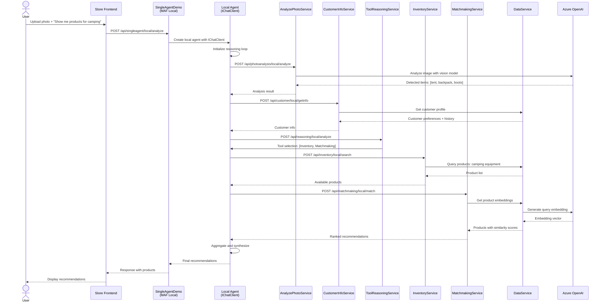
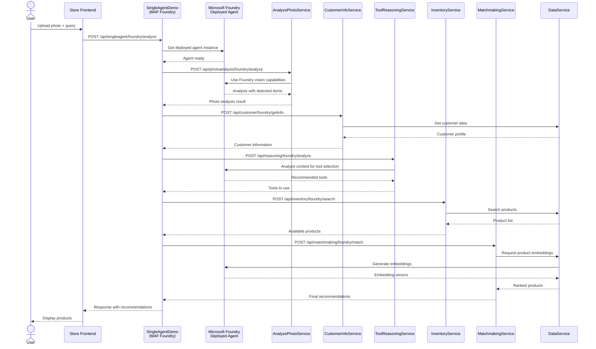
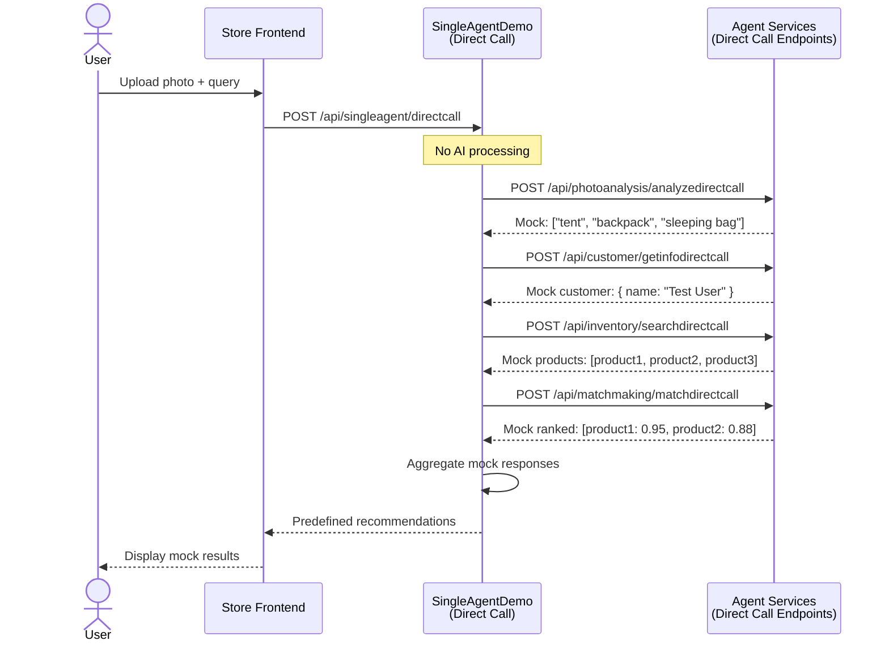

# BRK445 Single Agent Data Flow

## Overview

This document details the data flow and execution patterns for the SingleAgentDemo service, which demonstrates a single-agent workflow with reasoning loop. The agent analyzes customer photos, retrieves customer information, and makes personalized product recommendations.

## Related Documentation

- [General Architecture](./ARCHITECTURE_GENERAL.md) - Architectural principles and patterns
- [Component Architecture](./ARCHITECTURE_COMPONENTS.md) - Component descriptions
- [Multi Agent Data Flow](./ARCHITECTURE_DATAFLOW_MULTI.md) - MultiAgentDemo patterns
- [Deployment Guide](./ARCHITECTURE_DEPLOYMENT.md) - Deployment instructions

## Operating Modes

SingleAgentDemo supports three operating modes, executed in this order:

1. **MAF Local Mode** - Agents created locally with IChatClient
2. **MAF Foundry Mode** - Agents deployed in Microsoft Foundry
3. **Direct Call Mode** - No AI, returns mock responses

## MAF Local Mode Data Flow

### Overview

In MAF Local mode, agents are created locally using `IChatClient` and Azure OpenAI. This mode is suitable for development and testing without requiring Microsoft Foundry agent deployments.

### Architecture

```
┌──────────┐
│  Store   │ User uploads photo + question
│ Frontend │
└────┬─────┘
     │ HTTP POST
     ▼
┌────────────────────┐
│ SingleAgentDemo    │
│ (MAF Local Mode)   │ /api/singleagent/local/analyze
└────┬───────────────┘
     │
     │ Create Local Agent
     ▼
┌──────────────────────┐
│ MAF Local Agent      │
│ (with IChatClient)   │
└────┬─────────────────┘
     │
     │ Reasoning Loop - Determines which tools to call
     │
     ├──→ AnalyzePhotoService     /api/photoanalysis/local/analyze
     │   └─→ DataService           (if needed for context)
     │
     ├──→ CustomerInfoService      /api/customer/local/getinfo
     │   └─→ DataService           (customer data from SQL)
     │
     ├──→ ToolReasoningService     /api/reasoning/local/analyze
     │   └─→ DataService           (tool selection context)
     │
     ├──→ InventoryService         /api/inventory/local/search
     │   └─→ DataService           (product search in SQL)
     │
     └──→ MatchmakingService       /api/matchmaking/local/match
         └─→ DataService           (similarity search with embeddings)
              └─→ Azure OpenAI     (embedding generation)
     
     │ Aggregate Results
     ▼
┌──────────────────────┐
│ Response to Store    │
│ - Recommendations    │
│ - Reasoning trace    │
│ - Product details    │
└──────────────────────┘
```

### Mermaid Diagram



### Detailed Step-by-Step Flow

#### Step 1: Request Initiation
```
User → Store Frontend
- User uploads photo
- User enters question: "Show me products for camping"
- Store calls: POST /api/singleagent/local/analyze
```

#### Step 2: Agent Creation
```csharp
// SingleAgentDemo creates local agent
var chatClient = serviceProvider.GetRequiredService<IChatClient>();
var agent = new LocalAgent(chatClient, agentConfiguration);
```

#### Step 3: Photo Analysis
```
Agent → AnalyzePhotoService
- POST /api/photoanalysis/local/analyze
- Request: { imageUrl, userId }

AnalyzePhotoService → Azure OpenAI
- Vision model analyzes image
- Extracts: Objects, colors, activities

Response: {
  detectedItems: ["tent", "backpack", "hiking boots"],
  activity: "camping",
  environment: "outdoor"
}
```

#### Step 4: Customer Information Retrieval
```
Agent → CustomerInformationService
- POST /api/customer/local/getinfo
- Request: { customerId }

CustomerInformationService → DataService
- GET /customers/{id}
- Queries SQL database

Response: {
  name: "John Doe",
  preferences: ["outdoor gear", "hiking"],
  purchaseHistory: ["tent:2023-06", "boots:2023-03"]
}
```

#### Step 5: Tool Reasoning
```
Agent → ToolReasoningService
- POST /api/reasoning/local/analyze
- Request: { context, detectedItems, customerInfo }

ToolReasoningService → Local Agent
- Analyzes context: "camping" + "outdoor preferences"
- Determines tools needed

Response: {
  recommendedTools: ["InventoryService", "MatchmakingService"],
  reasoning: "Customer needs camping equipment matching their preferences"
}
```

#### Step 6: Inventory Search
```
Agent → InventoryService
- POST /api/inventory/local/search
- Request: { category: "camping", keywords: ["tent", "backpack", "boots"] }

InventoryService → DataService
- POST /products/search
- SQL query with filters

Response: {
  products: [
    { id: 1, name: "Alpine Tent", category: "camping", price: 299.99 },
    { id: 2, name: "Trail Backpack", category: "camping", price: 89.99 },
    { id: 3, name: "Hiking Boots", category: "camping", price: 149.99 }
  ]
}
```

#### Step 7: Matchmaking
```
Agent → MatchmakingService
- POST /api/matchmaking/local/match
- Request: { products, customerPreferences, detectedItems }

MatchmakingService → DataService
- POST /products/similar
- Request: { queryText: "camping equipment for outdoor hiking" }

DataService → Azure OpenAI
- Generate embedding for query
- Request: Embedding API with query text

Azure OpenAI → DataService
- Response: Embedding vector [768 dimensions]

DataService → SQL Database
- Vector similarity search
- Compare query embedding with product embeddings

Response: {
  rankedProducts: [
    { id: 1, name: "Alpine Tent", score: 0.94, reason: "Perfect for camping" },
    { id: 3, name: "Hiking Boots", score: 0.89, reason: "Matches outdoor activity" },
    { id: 2, name: "Trail Backpack", score: 0.85, reason: "Essential camping gear" }
  ]
}
```

#### Step 8: Response Aggregation
```csharp
// Agent synthesizes final response
var response = new {
    recommendations = rankedProducts.Take(3),
    reasoning = "Based on your photo and preferences...",
    totalProducts = rankedProducts.Count,
    confidence = 0.92
};

return response;
```

### Data Format Examples

**Request to SingleAgentDemo**:
```json
{
  "imageUrl": "https://storage/photo.jpg",
  "userId": "user123",
  "query": "Show me products for camping"
}
```

**Response from SingleAgentDemo**:
```json
{
  "recommendations": [
    {
      "productId": 1,
      "name": "Alpine Tent",
      "description": "4-person camping tent",
      "price": 299.99,
      "matchScore": 0.94,
      "reason": "Perfect for camping activities shown in your photo"
    }
  ],
  "reasoning": "Based on the camping equipment in your photo and your outdoor preferences, these products match your needs.",
  "confidence": 0.92,
  "mode": "maf_local"
}
```

---

## MAF Foundry Mode Data Flow

### Overview

In MAF Foundry mode, agents are deployed and managed in Microsoft Foundry. This mode is suitable for production deployments with enterprise-grade agent management.

### Architecture

```
┌──────────┐
│  Store   │ User uploads photo + question
│ Frontend │
└────┬─────┘
     │ HTTP POST
     ▼
┌────────────────────┐
│ SingleAgentDemo    │
│ (MAF Foundry Mode) │ /api/singleagent/foundry/analyze
└────┬───────────────┘
     │
     │ Get Foundry Agent
     ▼
┌──────────────────────────┐
│ Microsoft Foundry        │
│ Deployed Agent           │
└────┬─────────────────────┘
     │
     │ Reasoning Loop - Agent determines tool calls
     │
     ├──→ AnalyzePhotoService     /api/photoanalysis/foundry/analyze
     │   └─→ Microsoft Foundry    (Vision AI capabilities)
     │
     ├──→ CustomerInfoService      /api/customer/foundry/getinfo
     │   └─→ DataService           (Customer data)
     │
     ├──→ ToolReasoningService     /api/reasoning/foundry/analyze
     │   └─→ Microsoft Foundry     (Tool selection)
     │
     ├──→ InventoryService         /api/inventory/foundry/search
     │   └─→ DataService           (Product queries)
     │
     └──→ MatchmakingService       /api/matchmaking/foundry/match
         └─→ DataService           (Vector similarity)
              └─→ Microsoft Foundry (Embeddings)
     
     │ Aggregate Results
     ▼
┌──────────────────────┐
│ Response to Store    │
│ - Recommendations    │
│ - Reasoning trace    │
│ - Product details    │
└──────────────────────┘
```

### Mermaid Diagram



### Key Differences from MAF Local Mode

1. **Agent Source**: Agent retrieved from Microsoft Foundry instead of created locally
2. **Management**: Centralized agent management in Microsoft Foundry portal
3. **Monitoring**: Built-in monitoring and evaluation in Microsoft Foundry
4. **Deployment**: Agent versions managed through Microsoft Foundry
5. **Scalability**: Microsoft Foundry handles agent scaling

### Configuration

```csharp
// Get Foundry agent
var agentProvider = serviceProvider.GetRequiredService<MAFFoundryAgentProvider>();
var agentId = AgentMetadata.GetAgentName(AgentType.SingleAgent);
var agent = agentProvider.GetAIAgent(agentId);

// Execute with Foundry agent
var response = await agent.ExecuteAsync(request);
```

---

## Direct Call Mode Data Flow

### Overview

Direct Call mode bypasses AI completely and returns predefined mock responses. This mode is useful for testing, offline development, and demonstrations without AI credentials.

### Architecture

```
┌──────────┐
│  Store   │ User uploads photo + question
│ Frontend │
└────┬─────┘
     │ HTTP POST
     ▼
┌────────────────────┐
│ SingleAgentDemo    │
│ (Direct Call Mode) │ /api/singleagent/directcall
└────┬───────────────┘
     │
     │ No AI - Return mock data
     │
     ├──→ AnalyzePhotoService     /api/photoanalysis/analyzedirectcall
     │   └─→ Mock response: ["tent", "backpack"]
     │
     ├──→ CustomerInfoService      /api/customer/getinfodirectcall
     │   └─→ Mock customer data
     │
     ├──→ InventoryService         /api/inventory/searchdirectcall
     │   └─→ Mock product list
     │
     └──→ MatchmakingService       /api/matchmaking/matchdirectcall
         └─→ Mock ranked products
     
     │ Aggregate Mock Results
     ▼
┌──────────────────────┐
│ Response to Store    │
│ - Mock recommendations│
│ - Predefined data    │
└──────────────────────┘
```

### Mermaid Diagram



### Example Mock Response

```csharp
[HttpPost("directcall")]
public IActionResult AnalyzeDirectCall()
{
    return Ok(new {
        recommendations = new[] {
            new { 
                productId = 1, 
                name = "Alpine Tent", 
                price = 299.99,
                matchScore = 0.95,
                reason = "[Mock] Popular camping tent"
            },
            new { 
                productId = 2, 
                name = "Trail Backpack", 
                price = 89.99,
                matchScore = 0.88,
                reason = "[Mock] Essential hiking gear"
            }
        },
        reasoning = "[Mock] Based on typical camping scenarios",
        confidence = 0.90,
        mode = "directcall"
    });
}
```

### Use Cases for Direct Call Mode

1. **Testing**: Run end-to-end tests without AI costs
2. **Development**: Work offline without AI credentials
3. **Demos**: Show system functionality without live AI
4. **CI/CD**: Automated testing in pipelines
5. **Fallback**: System continues to work if AI services are down

---

## Performance Characteristics

### MAF Local Mode
- **Latency**: 2-5 seconds typical
- **Dependencies**: Azure OpenAI, SQL Database
- **Scalability**: Limited by OpenAI rate limits
- **Cost**: Per-token pricing for chat and embeddings

### MAF Foundry Mode
- **Latency**: 3-6 seconds typical (includes Foundry overhead)
- **Dependencies**: Microsoft Foundry, SQL Database
- **Scalability**: Managed by Microsoft Foundry
- **Cost**: Microsoft Foundry agent execution + token costs

### Direct Call Mode
- **Latency**: < 100ms (no AI processing)
- **Dependencies**: None (self-contained)
- **Scalability**: Very high (simple HTTP responses)
- **Cost**: Minimal (compute only)

## Error Handling

### Retry Logic
```csharp
// Services use HttpClient with retry policy
builder.Services.AddHttpClient<InventoryService>()
    .AddStandardResilienceHandler();
```

### Fallback Strategy
```
Try MAF Foundry
  ↓ (on error)
Try MAF Local
  ↓ (on error)
Use Direct Call
  ↓
Return response (possibly degraded)
```

### Error Response Format
```json
{
  "error": "Service temporarily unavailable",
  "mode": "maf_local",
  "fallbackUsed": true,
  "recommendations": [],
  "message": "Using cached results"
}
```

## Monitoring and Observability

### Application Insights Traces

Each request generates traces showing:
- Request duration for each service call
- Dependency calls and their latencies
- Success/failure rates
- Custom agent metrics

### Example Trace
```
Request: POST /api/singleagent/local/analyze
  ├─ Dependency: POST /api/photoanalysis/local/analyze (542ms)
  ├─ Dependency: POST /api/customer/local/getinfo (123ms)
  ├─ Dependency: POST /api/inventory/local/search (891ms)
  └─ Dependency: POST /api/matchmaking/local/match (1204ms)
Total: 2760ms
```

## References

- [General Architecture](./ARCHITECTURE_GENERAL.md) - Architectural principles
- [Component Architecture](./ARCHITECTURE_COMPONENTS.md) - Component details
- [Multi Agent Data Flow](./ARCHITECTURE_DATAFLOW_MULTI.md) - MultiAgentDemo flow
- [Deployment Guide](./ARCHITECTURE_DEPLOYMENT.md) - Deployment instructions

---

**Version**: 2.0  
**Date**: December 2024  
**Authors**: Bruno Capuano, Kinfey Lo  
**Session**: Microsoft AI Tour 2026 - BRK445
