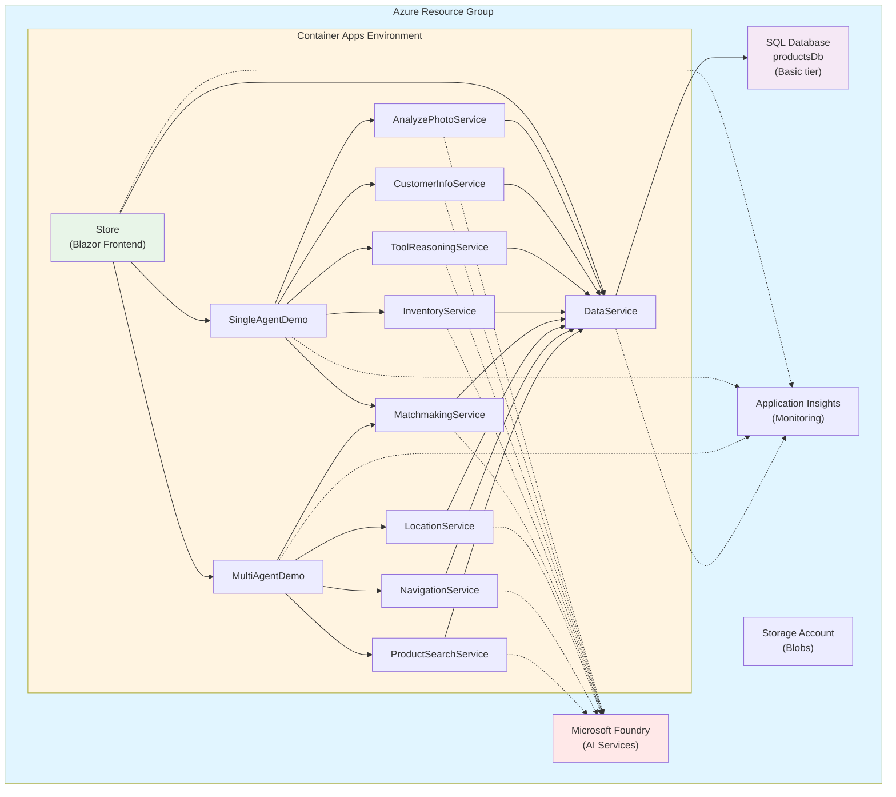

# BRK445 Deployment Guide

## Overview

This document provides comprehensive deployment instructions for the BRK445 solution, covering both local development with .NET Aspire and production deployment to Azure.

## Related Documentation

- [General Architecture](./ARCHITECTURE_GENERAL.md) - Architectural principles and patterns
- [Component Architecture](./ARCHITECTURE_COMPONENTS.md) - Component descriptions
- [Single Agent Data Flow](./ARCHITECTURE_DATAFLOW_SINGLE.md) - SingleAgentDemo patterns
- [Multi Agent Data Flow](./ARCHITECTURE_DATAFLOW_MULTI.md) - MultiAgentDemo patterns

## Deployment Options

The BRK445 solution supports two deployment models:

1. **Local Development**: .NET Aspire orchestration for development and testing
2. **Azure Production**: Azure Container Apps with full enterprise capabilities

## Local Development Deployment

### Prerequisites

#### Required Software

1. **.NET 9 SDK**
   ```bash
   # Download from: https://dotnet.microsoft.com/download/dotnet/9.0
   dotnet --version  # Should show 9.0 or higher
   ```

2. **.NET Aspire Workload**
   ```bash
   dotnet workload install aspire
   ```

3. **Docker Desktop**
   ```bash
   # Download from: https://www.docker.com/products/docker-desktop
   docker --version  # Verify installation
   ```

4. **Azure OpenAI or OpenAI API Key** (for MAF Local mode)

#### Configuration Files

Create `appsettings.Development.json` files in each service:

**Example for `src/DataService/appsettings.Development.json`**:
```json
{
  "ConnectionStrings": {
    "microsoftfoundrycnnstring": "Endpoint=https://YOUR-OPENAI-RESOURCE.openai.azure.com/;Key=YOUR-KEY",
    "microsoftfoundryproject": "Endpoint=https://YOUR-FOUNDRY-RESOURCE.cognitiveservices.azure.com/;Key=YOUR-KEY"
  },
  "AI_ChatDeploymentName": "gpt-5-mini",
  "AI_embeddingsDeploymentName": "text-embedding-3-small"
}
```

**Note**: Never commit these files. They're in `.gitignore`.

### Step-by-Step Local Deployment

#### Step 1: Clone and Build

```bash
# Clone repository
git clone https://github.com/elbruno/brk445-wip.git
cd brk445-wip/src

# Build solution
dotnet build
```

**Expected Output**:
```
Build succeeded.
    0 Warning(s)
    0 Error(s)
```

#### Step 2: Configure Connection Strings

Use `dotnet user-secrets` for secure local configuration:

```bash
# Navigate to each service directory and set secrets
cd src/DataService

dotnet user-secrets set "ConnectionStrings:microsoftfoundrycnnstring" "Endpoint=https://YOUR-RESOURCE.openai.azure.com/;Key=YOUR-KEY"

dotnet user-secrets set "ConnectionStrings:microsoftfoundryproject" "Endpoint=https://YOUR-FOUNDRY.cognitiveservices.azure.com/;Key=YOUR-KEY"
```

Repeat for: `SingleAgentDemo`, `MultiAgentDemo`, and all 8 agent services.

#### Step 3: Start Aspire Orchestration

```bash
# From src/ directory
./run-aspire.sh
```

**On Windows**:
```powershell
.\run-aspire.ps1
```

**What Happens**:
1. Docker containers start (SQL Server)
2. All 10+ microservices launch
3. Aspire Dashboard opens automatically (usually http://localhost:18888)
4. Services register and become healthy

**Aspire Dashboard Features**:
```
┌─────────────────────────────────────────────────┐
│         .NET Aspire Dashboard                    │
├─────────────────────────────────────────────────┤
│                                                  │
│ ► Resources                                      │
│   ├─ sql (Container)         [Running]          │
│   ├─ dataservice             [Running] ✓        │
│   ├─ analyzephotoservice     [Running] ✓        │
│   ├─ customerinfo...          [Running] ✓        │
│   └─ store                   [Running] ✓        │
│                                                  │
│ ► Console Logs                                   │
│   └─ Real-time logs from all services           │
│                                                  │
│ ► Traces                                         │
│   └─ Distributed request traces                 │
│                                                  │
│ ► Metrics                                        │
│   └─ CPU, Memory, Request rates                 │
└─────────────────────────────────────────────────┘
```

#### Step 4: Access the Application

Once Aspire reports all services as healthy:

```
Store Frontend: http://localhost:[port]
  (Port shown in Aspire Dashboard under 'store' resource)

SingleAgentDemo: http://localhost:[port]
MultiAgentDemo: http://localhost:[port]
```

#### Step 5: Verify Deployment

1. **Check Aspire Dashboard**:
   - All resources show green checkmark
   - Console logs show no errors

2. **Test Store Frontend**:
   - Navigate to Store URL
   - Check Settings page
   - Upload a test photo

3. **Test Agent Services**:
   ```bash
   # Check health endpoints
   curl http://localhost:[dataservice-port]/health
   curl http://localhost:[analyzephotoservice-port]/health
   ```

### Cleanup

```bash
# Stop all Aspire services
./cleanup-aspire.sh
```

**On Windows**:
```powershell
.\cleanup-aspire.ps1
```

This stops all containers and processes.

---

## Azure Production Deployment

### Architecture Overview

```
┌──────────────────────────────────────────────────────┐
│               Azure Resource Group                    │
├──────────────────────────────────────────────────────┤
│                                                       │
│  ┌─────────────────┐     ┌──────────────────┐      │
│  │  Container Apps │     │  SQL Database     │      │
│  │  Environment    │     │  - productsDb     │      │
│  │                 │     │  - Basic tier     │      │
│  │  ├─ Store      │     └──────────────────┘      │
│  │  ├─ SingleDemo │                                 │
│  │  ├─ MultiDemo  │     ┌──────────────────┐      │
│  │  ├─ DataService│     │  Microsoft       │      │
│  │  └─ 8x Agents  │     │  Foundry         │      │
│  └─────────────────┘     │  (AI Services)   │      │
│                           └──────────────────┘      │
│  ┌─────────────────┐                                 │
│  │  Application    │     ┌──────────────────┐      │
│  │  Insights       │     │  Storage         │      │
│  └─────────────────┘     │  Account         │      │
│                           └──────────────────┘      │
└──────────────────────────────────────────────────────┘
```

### Mermaid Diagram



### Prerequisites

#### Required Tools

1. **Azure CLI**
   ```bash
   # Install from: https://docs.microsoft.com/cli/azure/install-azure-cli
   az --version  # Verify installation
   
   # Login to Azure
   az login
   ```

2. **Python 3.9+**
   ```bash
   python --version  # Should be 3.9 or higher
   ```

3. **Azure Subscription**
   - Contributor permissions
   - Sufficient quota for resources

#### Required Permissions

- Resource Group creation
- Cognitive Services deployment (for Microsoft Foundry)
- SQL Server deployment
- Container Apps deployment
- Storage Account creation

### Automated Deployment with Python Script

#### Step 1: Navigate to Infrastructure Directory

```bash
cd infra
```

#### Step 2: Install Python Dependencies

```bash
pip install -r requirements.txt
```

#### Step 3: Run Deployment Script

```bash
python deploy_azure_resources.py
```

#### Step 4: Interactive Prompts

The script will guide you through:

```
============================================================
Current Azure Subscription:
============================================================
Name: My Azure Subscription
ID: xxxxxxxx-xxxx-xxxx-xxxx-xxxxxxxxxxxx
Tenant ID: yyyyyyyy-yyyy-yyyy-yyyy-yyyyyyyyyyyy
============================================================

Do you want to use this subscription? (yes/no): yes

============================================================
Resource Configuration
============================================================
Enter resource name (will be used as prefix) [brk445-demo]: brk445-prod
Enter Azure region [eastus2]: eastus

============================================================
SQL Server Credentials
============================================================
Enter SQL Server admin username [sqladmin]: sqladmin
Enter SQL Server admin password (min 8 characters) [press Enter to auto-generate]: 
✅ Generated secure password: xY9#mK2$pL4@wQ7z
   (This will be saved to output files)

============================================================
Deployment Summary
============================================================
Resource Prefix: brk445-prod
Region: eastus
Resource Group: brk445-prod-rg
SQL Username: sqladmin
SQL Password: [Generated - will be saved]
============================================================

Proceed with deployment? (yes/no): yes

🚀 Starting deployment...
⏳ Creating resource group...
✅ Resource group created: brk445-prod-rg

⏳ Deploying Bicep template...
[Deployment progress streams in real-time]

✅ Deployment completed successfully!

============================================================
Deployment Outputs
============================================================
SQL Server: brk445-prod-sqlserver.database.windows.net
Database: brk445-prod-db
Microsoft Foundry Endpoint: https://brk445-prod-foundry.cognitiveservices.azure.com/
Application Insights Connection String: [saved to file]

📁 Credentials saved to:
   - brk445-prod-credentials-20241216-143022.json
   - brk445-prod-credentials-20241216-143022.txt
============================================================
```

#### What Gets Deployed

1. **Resource Group**: `brk445-prod-rg`
2. **Application Insights**: Monitoring and telemetry
3. **Log Analytics Workspace**: Backend for Application Insights
4. **Storage Account**: Blob storage (lowercase name with unique suffix)
5. **Microsoft Foundry**: AI Services (kind: 'AIServices')
   - Chat model: gpt-5-mini
   - Embeddings model: text-embedding-3-small
6. **SQL Server**: Basic tier
   - Firewall rule: Allow Azure services
   - TLS 1.2 minimum
7. **SQL Database**: productsDb (Basic tier, 5 DTU)

### Manual Deployment with Azure CLI

If you prefer manual control:

#### Step 1: Create Resource Group

```bash
az group create \
  --name brk445-prod-rg \
  --location eastus
```

#### Step 2: Deploy Bicep Template

```bash
az deployment group create \
  --resource-group brk445-prod-rg \
  --template-file main.bicep \
  --parameters resourcePrefix=brk445-prod \
  --parameters sqlAdminUsername=sqladmin \
  --parameters sqlAdminPassword='YourSecurePassword123!'
```

#### Step 3: Capture Outputs

```bash
# Get SQL connection string
az sql server show \
  --resource-group brk445-prod-rg \
  --name brk445-prod-sqlserver \
  --query fullyQualifiedDomainName -o tsv

# Get Microsoft Foundry endpoint
az cognitiveservices account show \
  --resource-group brk445-prod-rg \
  --name brk445-prod-foundry \
  --query properties.endpoint -o tsv

# Get Application Insights connection string
az monitor app-insights component show \
  --resource-group brk445-prod-rg \
  --app brk445-prod-appinsights \
  --query connectionString -o tsv
```

### Container Apps Deployment

#### Using Azure Portal

1. Navigate to Azure Portal → Container Apps
2. Create new Container App Environment
3. For each service, create a Container App:
   - **Store**: Blazor frontend
   - **SingleAgentDemo**: Single agent orchestrator
   - **MultiAgentDemo**: Multi-agent orchestrator
   - **DataService**: Data access service
   - **8x Agent Services**: Individual agent microservices

4. Configure environment variables for each:
   ```
   ConnectionStrings__productsDb = [SQL connection string]
   ConnectionStrings__microsoftfoundrycnnstring = [Foundry connection]
   ConnectionStrings__microsoftfoundryproject = [Foundry project]
   APPLICATIONINSIGHTS_CONNECTION_STRING = [App Insights connection]
   AI_ChatDeploymentName = gpt-5-mini
   AI_embeddingsDeploymentName = text-embedding-3-small
   ```

#### Using Azure CLI

```bash
# Create Container Apps Environment
az containerapp env create \
  --name brk445-env \
  --resource-group brk445-prod-rg \
  --location eastus

# Deploy DataService
az containerapp create \
  --name dataservice \
  --resource-group brk445-prod-rg \
  --environment brk445-env \
  --image mcr.microsoft.com/dotnet/samples:aspnetapp \
  --target-port 8080 \
  --ingress external \
  --env-vars \
    "ConnectionStrings__productsDb=$SQL_CONNECTION_STRING" \
    "APPLICATIONINSIGHTS_CONNECTION_STRING=$APP_INSIGHTS_STRING"

# Repeat for each service...
```

### Database Initialization

After Azure resources are deployed:

#### Option 1: Using Console App

```bash
cd infra

# Run database initialization
dotnet run --project Brk445-Console-DeployAgents.csproj

# Follow prompts to:
# 1. Enter SQL connection string
# 2. Confirm initialization
# 3. Wait for schema creation and data seeding
```

#### Option 2: Using DataService Endpoint

```bash
# Once DataService is deployed, call initialization endpoint
curl -X GET https://your-dataservice-url.azurecontainerapps.io/data/initialize
```

### Post-Deployment Configuration

#### Update Application Settings

For each Container App, configure:

1. **Scaling Rules**:
   ```bash
   az containerapp update \
     --name store \
     --resource-group brk445-prod-rg \
     --min-replicas 1 \
     --max-replicas 5
   ```

2. **Health Probes**:
   ```bash
   az containerapp update \
     --name store \
     --resource-group brk445-prod-rg \
     --set-env-vars "HEALTH_CHECK_PATH=/health"
   ```

3. **Custom Domains** (optional):
   ```bash
   az containerapp hostname bind \
     --name store \
     --resource-group brk445-prod-rg \
     --hostname store.yourdomain.com
   ```

#### Configure Microsoft Foundry Agents

1. Navigate to Azure Portal → Microsoft Foundry resource
2. Deploy agents to Foundry:
   - AnalyzePhotoAgent
   - CustomerInfoAgent
   - ToolReasoningAgent
   - InventoryAgent
   - MatchmakingAgent
   - LocationAgent
   - NavigationAgent
   - ProductSearchAgent

3. Note agent IDs for configuration

### Verification

#### Step 1: Check Resource Deployment

```bash
# List all resources in group
az resource list \
  --resource-group brk445-prod-rg \
  --output table
```

**Expected Output**:
```
Name                          Type
----------------------------  -----------------------------------------
brk445-prod-sqlserver         Microsoft.Sql/servers
brk445-prod-db                Microsoft.Sql/servers/databases
brk445-prod-foundry           Microsoft.CognitiveServices/accounts
brk445-prod-appinsights       Microsoft.Insights/components
brk445-prod-st1234            Microsoft.Storage/storageAccounts
brk445-prod-law               Microsoft.OperationalInsights/workspaces
```

#### Step 2: Test SQL Connectivity

```bash
# From local machine with Azure SQL connection
sqlcmd -S brk445-prod-sqlserver.database.windows.net -d brk445-prod-db -U sqladmin -P [password]

# Run test query
SELECT COUNT(*) FROM Products;
GO
```

#### Step 3: Test Microsoft Foundry

```bash
# Test chat completion
curl -X POST https://brk445-prod-foundry.openai.azure.com/openai/deployments/gpt-5-mini/chat/completions?api-version=2024-02-01 \
  -H "api-key: YOUR-KEY" \
  -H "Content-Type: application/json" \
  -d '{"messages":[{"role":"user","content":"Hello"}]}'
```

#### Step 4: Test Container Apps

```bash
# Test Store frontend
curl https://store.brk445-prod.azurecontainerapps.io/health

# Test DataService
curl https://dataservice.brk445-prod.azurecontainerapps.io/health

# Expected: 200 OK
```

### Monitoring

#### Application Insights Queries

Navigate to Application Insights → Logs:

```kusto
// All requests in last hour
requests
| where timestamp > ago(1h)
| summarize count() by name, resultCode

// Failed requests
requests
| where success == false
| project timestamp, name, resultCode, duration

// Service dependencies
dependencies
| where timestamp > ago(1h)
| summarize count(), avg(duration) by target, name

// Custom agent metrics
customMetrics
| where name == "AgentExecutionTime"
| summarize avg(value), max(value) by tostring(customDimensions.AgentType)
```

#### Container Apps Logs

```bash
# View logs for a specific container app
az containerapp logs show \
  --name store \
  --resource-group brk445-prod-rg \
  --follow

# View logs for all replicas
az containerapp logs tail \
  --name dataservice \
  --resource-group brk445-prod-rg
```

### Scaling

#### Manual Scaling

```bash
# Scale up
az containerapp update \
  --name store \
  --resource-group brk445-prod-rg \
  --min-replicas 2 \
  --max-replicas 10

# Scale down
az containerapp update \
  --name store \
  --resource-group brk445-prod-rg \
  --min-replicas 1 \
  --max-replicas 3
```

#### Auto-Scaling Rules

```bash
# Scale based on HTTP requests
az containerapp update \
  --name store \
  --resource-group brk445-prod-rg \
  --scale-rule-name http-rule \
  --scale-rule-type http \
  --scale-rule-http-concurrency 50
```

### Cost Optimization

#### Development/Test Environment

- **SQL Database**: Basic tier (5 DTU) ~ $5/month
- **Microsoft Foundry**: Pay-per-token
- **Container Apps**: Consumption plan (pay-per-use)
- **Storage**: Standard LRS ~ $0.02/GB/month
- **Application Insights**: First 5GB free, then $2.30/GB

**Estimated Monthly Cost**: $50-150 (depending on usage)

#### Production Environment

- **SQL Database**: Standard tier (S2: 50 DTU) ~ $150/month
- **Microsoft Foundry**: Pay-per-token (estimate based on usage)
- **Container Apps**: Dedicated plan ~ $200/month
- **Storage**: Standard LRS ~ $0.02/GB/month
- **Application Insights**: Based on ingestion

**Estimated Monthly Cost**: $500-1500 (depending on usage)

### Cleanup

#### Delete All Resources

```bash
# Delete entire resource group (removes all resources)
az group delete \
  --name brk445-prod-rg \
  --yes \
  --no-wait
```

#### Selective Cleanup

```bash
# Delete specific Container App
az containerapp delete \
  --name store \
  --resource-group brk445-prod-rg \
  --yes

# Delete SQL Database (keep server)
az sql db delete \
  --name brk445-prod-db \
  --server brk445-prod-sqlserver \
  --resource-group brk445-prod-rg \
  --yes
```

## Troubleshooting

### Common Issues

#### Issue: SQL Connection Timeout

**Symptoms**: DataService cannot connect to SQL

**Solution**:
```bash
# Add your IP to SQL firewall
az sql server firewall-rule create \
  --resource-group brk445-prod-rg \
  --server brk445-prod-sqlserver \
  --name AllowMyIP \
  --start-ip-address YOUR-IP \
  --end-ip-address YOUR-IP
```

#### Issue: Container App Not Starting

**Symptoms**: Container app shows "Provisioning" forever

**Solution**:
```bash
# Check logs
az containerapp logs show \
  --name store \
  --resource-group brk445-prod-rg

# Check revision status
az containerapp revision list \
  --name store \
  --resource-group brk445-prod-rg \
  --output table
```

#### Issue: Microsoft Foundry Rate Limits

**Symptoms**: 429 errors from Microsoft Foundry

**Solution**:
- Increase deployment SKU capacity
- Implement retry logic with exponential backoff
- Consider request batching

#### Issue: High Application Insights Costs

**Symptoms**: Unexpected Azure bill

**Solution**:
```bash
# Set daily cap
az monitor app-insights component update \
  --app brk445-prod-appinsights \
  --resource-group brk445-prod-rg \
  --cap 1  # 1 GB per day

# Reduce sampling rate (in code)
builder.Services.AddApplicationInsightsTelemetry(options => {
    options.SamplingPercentage = 50; // Sample 50% of requests
});
```

## References

- [General Architecture](./ARCHITECTURE_GENERAL.md) - Architectural principles
- [Component Architecture](./ARCHITECTURE_COMPONENTS.md) - Component details
- [Database Initialization](./DATABASE_INITIALIZATION.md) - Database setup
- [Azure Container Apps Docs](https://learn.microsoft.com/azure/container-apps/)
- [Microsoft Foundry Docs](https://learn.microsoft.com/azure/ai-studio/)

---

**Version**: 2.0  
**Date**: December 2024  
**Authors**: Bruno Capuano, Kinfey Lo  
**Session**: Microsoft AI Tour 2026 - BRK445
