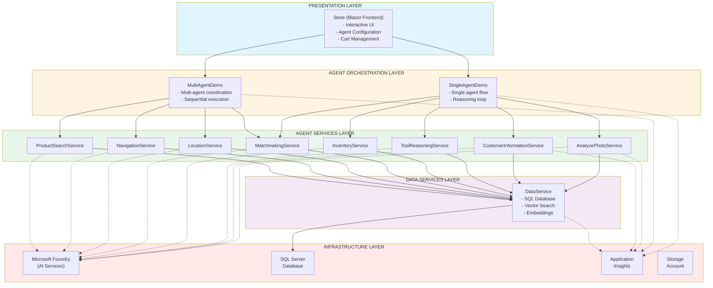

# BRK445 General Architecture

## Executive Summary

BRK445 is an enterprise demonstration solution showcasing patterns and best practices for building production-ready AI agents using Microsoft Foundry. The architecture implements a clear separation of concerns between agents, tools/services, and orchestration, all based on microservices with support for both local and cloud deployment.

## Related Documentation

- [Component Architecture](./ARCHITECTURE_COMPONENTS.md) - Detailed component descriptions and layers
- [Single Agent Data Flow](./ARCHITECTURE_DATAFLOW_SINGLE.md) - SingleAgentDemo execution patterns
- [Multi Agent Data Flow](./ARCHITECTURE_DATAFLOW_MULTI.md) - MultiAgentDemo orchestration patterns
- [Deployment Guide](./ARCHITECTURE_DEPLOYMENT.md) - Local and Azure deployment details

## Architectural Principles

### 1. Separation of Concerns
- **Agents**: AI reasoning and decision-making logic
- **Tools/Services**: Business functionality and data integration
- **Orchestration**: Workflow coordination and service composition

### 2. Independent Microservices
Each agent and service operates as an independent HTTP microservice, enabling:
- Independent scalability
- Isolated deployment
- Per-service authentication and rate limiting boundaries
- Enhanced resilience

### 3. Framework Flexibility
The solution uses Microsoft Agent Framework (Microsoft.Agents.AI) for building and deploying AI agents:
- **MAF Foundry**: Agents deployed in Microsoft Foundry (cloud)
- **MAF Local**: Agents created locally with IChatClient
- Runtime switching between modes via UI configuration

### 4. Local + Cloud Ready
- **Local Development**: .NET Aspire for orchestration and testing
- **Cloud Production**: Azure Container Apps with full telemetry

## High-Level Architecture

### 5-Layer Architecture

```
┌─────────────────────────────────────────────────────────────────────────┐
│                         PRESENTATION LAYER                               │
│  ┌─────────────────────────────────────────────────────────────────┐   │
│  │  Store (Blazor Frontend)                                         │   │
│  │  - Interactive UI                                                │   │
│  │  - Agent Framework Configuration                                │   │
│  │  - Cart Management and Checkout                                 │   │
│  └─────────────────────────────────────────────────────────────────┘   │
└─────────────────────────────────────────────────────────────────────────┘
                                    │
                                    ▼
┌─────────────────────────────────────────────────────────────────────────┐
│                      AGENT ORCHESTRATION LAYER                           │
│  ┌────────────────────────┐       ┌────────────────────────┐           │
│  │  SingleAgentDemo       │       │  MultiAgentDemo        │           │
│  │  - Single agent flow   │       │  - Sequential multi-   │           │
│  │  - Reasoning loop      │       │    agent coordination  │           │
│  │  - MAF controllers     │       │  - MAF controllers     │           │
│  └────────────────────────┘       └────────────────────────┘           │
└─────────────────────────────────────────────────────────────────────────┘
                                    │
                                    ▼
┌─────────────────────────────────────────────────────────────────────────┐
│                       AGENT SERVICES LAYER                               │
│  ┌──────────────┐  ┌──────────────┐  ┌──────────────┐  ┌──────────┐  │
│  │AnalyzePhoto  │  │CustomerInfo  │  │ToolReasoning │  │Inventory │  │
│  │Service       │  │Service       │  │Service       │  │Service   │  │
│  └──────────────┘  └──────────────┘  └──────────────┘  └──────────┘  │
│                                                                          │
│  ┌──────────────┐  ┌──────────────┐  ┌──────────────┐  ┌──────────┐  │
│  │Matchmaking   │  │Location      │  │Navigation    │  │Product   │  │
│  │Service       │  │Service       │  │Service       │  │Search    │  │
│  └──────────────┘  └──────────────┘  └──────────────┘  └──────────┘  │
│                                                                          │
│  Each service exposes three modes:                                     │
│  - MAF Local (agents with IChatClient)                                 │
│  - MAF Foundry (Microsoft Foundry deployed agents)                     │
│  - Direct Call (no AI, for testing)                                   │
└─────────────────────────────────────────────────────────────────────────┘
                                    │
                                    ▼
┌─────────────────────────────────────────────────────────────────────────┐
│                          DATA SERVICES LAYER                             │
│  ┌─────────────────────────────────────────────────────────────────┐   │
│  │  DataService                                                      │   │
│  │  - SQL database access                                           │   │
│  │  - Product endpoints                                             │   │
│  │  - Vector memory for semantic search                            │   │
│  │  - Embeddings generation                                         │   │
│  └─────────────────────────────────────────────────────────────────┘   │
└─────────────────────────────────────────────────────────────────────────┘
                                    │
                                    ▼
┌─────────────────────────────────────────────────────────────────────────┐
│                          INFRASTRUCTURE LAYER                            │
│  ┌──────────────┐  ┌──────────────┐  ┌──────────────┐  ┌──────────┐  │
│  │Microsoft     │  │SQL Server    │  │Application   │  │Storage   │  │
│  │Foundry       │  │Database      │  │Insights      │  │Account   │  │
│  │(AI Services) │  │              │  │              │  │          │  │
│  └──────────────┘  └──────────────┘  └──────────────┘  └──────────┘  │
└─────────────────────────────────────────────────────────────────────────┘
```

### Mermaid Diagram



## Design Patterns

### 1. Microservice Agent Pattern

Each agent is an independent HTTP microservice with:
- Its own configuration and dependencies
- HTTP endpoints exposed
- Independent registration in Aspire
- Dedicated telemetry and logging

**Benefits**:
- Loose coupling
- Independent scalability
- Clear responsibility boundaries
- Easy testing and deployment

### 2. Strategy Pattern (Operating Mode Selection)

Agent operating modes can be switched at runtime:

```csharp
// Each agent service has three modes
/api/[agent]/local/*       → MAF Local mode (IChatClient-based agents)
/api/[agent]/foundry/*     → MAF Foundry mode (Microsoft Foundry agents)
/api/[agent]/directcall/*  → Direct call mode (no AI, testing)
```

The frontend routes to the appropriate mode based on user configuration stored in `localStorage`.

**Benefits**:
- Flexibility in agent execution
- No recompilation needed
- Easy comparison between modes
- Smooth migration path

### 3. Circuit Breaker / Fallback Pattern

Each agent service provides a "direct call" mode that bypasses AI:

```csharp
[HttpPost("analyzedirectcall")]
public IActionResult AnalyzePhotoDirectCall()
{
    return Ok(new { 
        result = "Fallback response",
        mode = "directcall" 
    });
}
```

**Benefits**:
- System works even if AI fails
- Testing without LLM costs
- Offline development
- Demo without credentials

### 4. Service Client Pattern

`DataServiceClient` provides a typed client for accessing DataService:

```csharp
builder.Services.AddDataServiceClient("https+http://dataservice");
```

**Benefits**:
- Type-safe APIs
- Built-in retry logic
- Consistent error handling
- Easy mocking for tests

### 5. Dependency Injection Pattern

All services use .NET DI for:
- Agents (MAFFoundryAgentProvider, MAFLocalAgentProvider)
- HTTP clients (IHttpClientFactory)
- Configuration (IConfiguration)
- Logging (ILogger)

**Benefits**:
- Testability
- Loose coupling
- Automatic lifetime management
- Flexible configuration

## Agent Operating Modes

### MAF Local Mode
- Uses locally created agents with `IChatClient`
- Direct connection to Azure OpenAI or OpenAI endpoints
- Suitable for development and testing
- No Microsoft Foundry project required

### MAF Foundry Mode
- Uses agents deployed in Microsoft Foundry
- Leverages enterprise agent management
- Suitable for production deployments
- Requires Microsoft Foundry project connection

### Direct Call Mode
- Bypasses AI completely
- Returns predefined mock responses
- Useful for:
  - Testing without AI costs
  - Offline development
  - Demonstrations without credentials
  - CI/CD pipelines

## Microsoft Foundry Integration

### Resource Definition

The solution uses Microsoft Foundry AI Services (not ML Workspaces):

```bicep
resource aiServices 'Microsoft.CognitiveServices/accounts@2023-10-01-preview' = {
  kind: 'AIServices'
  sku: { name: 'S0' }
  properties: { 
    customSubDomainName: '...', 
    publicNetworkAccess: 'Enabled' 
  }
}
```

**Key Points**:
- Single unified resource (not hub/project with managed resource groups)
- All deployments in the same resource group
- Connection string key: `microsoftfoundryproject` in `appsettings.json`

### Agent Registration Pattern

```csharp
var microsoftFoundryProjectConnection = 
    builder.Configuration.GetConnectionString("microsoftfoundryproject");
    
builder.Services.AddSingleton(_ => 
    new MAFFoundryAgentProvider(microsoftFoundryProjectConnection!));
    
builder.Services.AddSingleton<AIAgent>(sp => {
    var agentId = AgentMetadata.GetAgentName(AgentType.NavigationAgent);
    return sp.GetRequiredService<MAFFoundryAgentProvider>().GetAIAgent(agentId);
});
```

## Observability and Telemetry

### Application Insights

All services send telemetry to Application Insights:

**Metrics Captured**:
- HTTP request response times
- Error rates and exceptions
- Dependency calls (SQL, HTTP, OpenAI)
- Distributed traces across services
- Custom agent metrics

**Configuration**:
```csharp
builder.AddServiceDefaults(); // Includes Application Insights
```

### Aspire Dashboard

During local development, the Aspire dashboard provides:

- **Service Health**: Real-time status of each microservice
- **Consolidated Logs**: Logs from all services in one view
- **Distributed Traces**: Request tracking across services
- **Resource Metrics**: CPU, memory, requests per second
- **Dependencies**: Visualization of dependency graph

### Structured Logging

All services use ILogger with structured logging:

```csharp
logger.LogInformation(
    "Processing request for user {UserId} with product {ProductId}", 
    userId, 
    productId
);
```

**Log Levels**:
- `Information`: Normal operations
- `Warning`: Recoverable situations
- `Error`: Errors requiring attention
- `Debug`: Debugging information (development only)

## Security

### Authentication and Authorization

**Current State**:
- Services do not implement authentication (demo purposes)
- Configured with `app.UseAuthorization()` ready for extension

**Production Recommendations**:
- Implement Azure AD B2C for user authentication
- API keys or OAuth 2.0 for service-to-service
- Managed Identity for Azure resource access
- Azure API Management as gateway with security policies

### Secrets Management

**Development**:
- Secrets in `appsettings.Development.json` (not committed)
- User Secrets for local development: `dotnet user-secrets`

**Production**:
- Azure Key Vault for all secrets
- Managed Identity for passwordless access
- Connection strings via environment variables

### Input Validation

All endpoints validate inputs:
```csharp
[HttpPost("analyze")]
public async Task<IActionResult> Analyze([FromBody] AnalyzeRequest request)
{
    if (string.IsNullOrWhiteSpace(request.ImageUrl))
        return BadRequest("ImageUrl is required");
    
    // ... processing
}
```

### Network Security

**Azure**:
- SQL firewall configured to allow only Azure services
- TLS 1.2 minimum on all communications
- Application Insights with controlled public network access

**Local**:
- Services exposed only on localhost
- HTTPS enforcement in production

## Scalability and Performance

### Scalability Strategies

1. **Horizontal Service Scaling**
   - Each microservice scales independently
   - Azure Container Apps supports metrics-based autoscaling

2. **Embeddings Caching**
   - DataService caches product embeddings
   - Reduces calls to Azure OpenAI

3. **Efficient Vector Search**
   - Pre-calculated embeddings in database
   - Optimized similarity search

4. **Connection Pooling**
   - Entity Framework uses connection pooling automatically
   - HttpClient reused via IHttpClientFactory

### Performance Considerations

**Optimizations Implemented**:
- Async/await for all I/O operations
- Streaming responses when possible
- Lazy loading of dependencies
- Minimized serialization/deserialization

**Monitoring**:
- Application Insights for bottleneck identification
- Latency metrics per service
- SQL Server query performance

## Testing

### Test Structure

```
src/
├── DataService.Tests/
│   └── Unit tests for DataService
├── Store.Tests/
│   └── Unit tests for Store frontend
├── ZavaMAFFoundry.Tests/
│   └── Integration tests with Foundry
└── ZavaMAFLocal.Tests/
    └── Tests for local agents
```

### Test Types

1. **Unit Tests**
   - Testing isolated business logic
   - Mocking external dependencies
   - xUnit framework

2. **Integration Tests**
   - Testing services with real dependencies
   - In-memory database for SQL
   - Mocked HTTP clients

3. **E2E Tests** (future)
   - Testing complete flows
   - Playwright or Selenium for UI
   - Real or mock services

### Running Tests

```bash
# All tests
dotnet test

# With code coverage
dotnet-coverage collect -f cobertura -o coverage.xml dotnet test

# Specific tests
dotnet test --filter "FullyQualifiedName~DataService"
```

## Code Conventions

### Naming

- **Projects**: PascalCase (e.g., `AnalyzePhotoService`)
- **Services in Aspire**: lowercase (e.g., `analyzephotoservice`)
- **Connection strings**: lowercase (e.g., `microsoftfoundryproject`)
- **Private fields**: camelCase with `_` (e.g., `_logger`)
- **Public methods**: PascalCase (e.g., `AnalyzePhoto`)

### File I/O

Always use UTF-8 encoding:
```csharp
File.WriteAllText(path, content, Encoding.UTF8);
```

### Entity Models

- **DTOs**: Use `record` for immutability
- **Responses**: Suffix "Result" or "Response"
- **Requests**: Suffix "Request"

```csharp
public record AiPhotoAnalysisResult(
    string Analysis, 
    List<string> DetectedItems
);
```

### Controllers

- Inherit from `ControllerBase` (not `Controller` for APIs)
- Routes with attributes `[Route("api/[controller]")]`
- Async methods with Task return types
- Proper HTTP status codes

## Architecture Decision Records

### ADR-001: Microsoft Foundry AI Services vs ML Workspaces

**Decision**: Use Microsoft Foundry AI Services (type: 'AIServices') instead of ML Workspaces.

**Context**: Azure offers two ways to deploy AI resources.

**Reason**:
- AI Services creates resources in the same resource group
- ML Workspaces creates managed resource groups
- AI Services is simpler for demos
- All resources visible in one place

**Consequences**:
- Cleaner and more predictable deployment
- Easier billing tracking
- Less management overhead

### ADR-002: Runtime Mode Selection

**Decision**: Allow switching between MAF Local, MAF Foundry, and Direct Call modes at runtime via UI.

**Context**: The solution must demonstrate multiple operating modes.

**Reason**:
- Easy comparison without recompilation
- Better demo experience
- No vendor lock-in
- Smooth migration path for customers

**Consequences**:
- Code for all three modes in each service
- More complexity in frontend routing
- Benefit: maximum flexibility

### ADR-003: Microservice per Agent

**Decision**: Each agent is an independent HTTP microservice.

**Context**: Agents could be classes in a monolith or separate services.

**Reason**:
- Independent scalability
- Clear responsibility boundaries
- Independent deployment
- Better for demos (shows real architecture)

**Consequences**:
- Greater operational complexity
- Network overhead between services
- Benefit: production-ready architecture

### ADR-004: Direct Call Mode

**Decision**: All agent services have a "direct call" mode without AI.

**Context**: Demos need to work without AI credentials.

**Reason**:
- Testing without LLM costs
- Offline development
- Fallback when AI fails
- Useful for CI/CD pipelines

**Consequences**:
- Additional code to maintain
- Mock responses to manage
- Benefit: resilience and flexibility

## Quick Reference Commands

### Local Development

```bash
# Build solution
cd src
dotnet build

# Start Aspire (all services)
./run-aspire.sh

# Clean up Aspire
./cleanup-aspire.sh

# Reset database
dotnet run --project DataService -- --reset-db
```

### Azure Deployment

```bash
# Deploy infrastructure
cd infra
python deploy_azure_resources.py

# Verify deployment
az group show --name brk445-zava-rg
az cognitiveservices account list --resource-group brk445-zava-rg
```

### Testing

```bash
# Run all tests
dotnet test

# Verbose output
dotnet test --logger "console;verbosity=detailed"

# Code coverage
dotnet-coverage collect -f cobertura -o coverage.xml dotnet test
```

### Debugging

```bash
# Check service health
curl http://localhost:[port]/health

# View service configuration
curl http://localhost:[port]/health/log
```

## References

- [Component Architecture](./ARCHITECTURE_COMPONENTS.md) - Detailed component descriptions
- [Single Agent Data Flow](./ARCHITECTURE_DATAFLOW_SINGLE.md) - SingleAgentDemo patterns
- [Multi Agent Data Flow](./ARCHITECTURE_DATAFLOW_MULTI.md) - MultiAgentDemo patterns
- [Deployment Guide](./ARCHITECTURE_DEPLOYMENT.md) - Deployment instructions
- [Database Initialization](./DATABASE_INITIALIZATION.md) - Database setup
- [Main README](../README.MD) - Project overview

---

**Version**: 2.0  
**Date**: December 2024  
**Authors**: Bruno Capuano, Kinfey Lo  
**Session**: Microsoft AI Tour 2026 - BRK445
