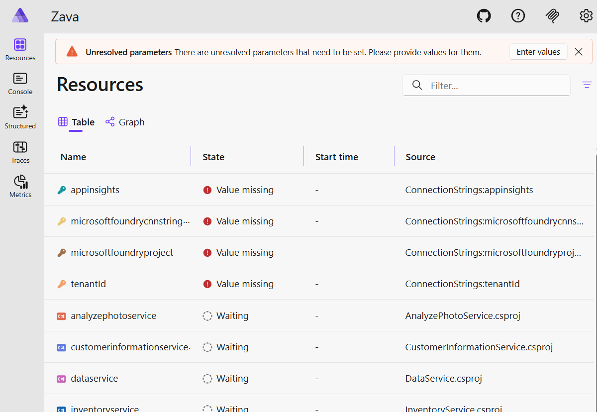

# How to run the demo locally

This file provides step-by-step instructions to build and run the `aspiredemo` (`src/BRK445-Zava-Aspire.slnx`) solution locally. 

## Agent Framework Selection and Working modes

The Store frontend allows switching between different working modes. The available modes and their behavior are defined in code in `src/ZavaWorkingModes/WorkingMode.cs` (see `WorkingMode` and `WorkingModeProvider`). Use the **Settings** page in the Store frontend to switch modes. Selections are saved to browser `localStorage` and are applied immediately.

Available working modes (as defined by the code):

- DirectCall (short name: `directcall`) — "Direct HTTP Call": the UI performs direct HTTP calls to the backend business services without AI orchestration.
- Llm (short name: `llm`) — "LLM Direct Call": direct interaction with large language models using the configured LLM client for agent-like behaviors.
- MafFoundry (short name: `maf_foundry`) — "MAF - Microsoft Foundry Agents": uses Microsoft Agent Framework agents deployed and hosted in Microsoft Foundry (this is the default working mode).
- MafAIFoundry (short name: `maf_ai_foundry`) — "MAF - Microsoft AI Foundry Agents": variant that targets Microsoft AI Foundry-hosted agents (also supported by the parser)
- MafLocal (short name: `maf_local`) — "MAF - Local Agents": creates local agents using the configured local model (e.g. gpt-5-mini) and configured tools.

Notes from the implementation in `src/ZavaWorkingModes`:

- The default mode is `MafFoundry`.
- The provider exposes display names, short names (used in URLs/localStorage) and human-friendly descriptions.
- The parser supports short names such as `directcall`, `llm`, `maf_foundry`, `maf_ai_foundry`, `maf_local` and falls back to the default when an unknown value is provided.

For the authoritative list of working modes, short names, display names and descriptions see the code: `src/ZavaWorkingModes/WorkingMode.cs`.

### Selecting the working mode

1. Open the **Store** application in your browser.
1. Navigate to **Settings** in the left-hand navigation.
1. Pick one of the working modes above.
1. Your selection is saved automatically in `localStorage` and takes effect immediately — no restart required.

***Note:** if the browser does not reflect the change, try pressing `Ctrl+F5` (hard refresh) to clear any cached data.*

**Important:** Before running the solutiom, make sure you are authenticated with Azure CLI. The demo's deployment helpers and some parts of the tooling rely on `DefaultAzureCredential`, which uses your Azure CLI login.

```bash
# Login to Azure with your tenant (device code flow)
az login --tenant <your-tenant-url> --use-device-code

# Verify you're logged in
az account show
```


## Quick start (terminal)

Open PowerShell / Bash in the solution folder `./src` and run the Aspire CLI to start the local dev-time orchestration. This repository uses the Aspire AppHost pattern and the solution file is `src/BRK445-Zava-Aspire.slnx`.

From the `src` folder run:

```bash
# Start dev-time orchestration with Aspire (preferred)
aspire run
```

The `aspire run` command will automatically find the AppHost, build the solution, and launch the dev-time orchestration. When ready it will print a dashboard URL with a login token — open that URL to access the Aspire dashboard and the demo UI. See https://aspire.dev/get-started/first-app/#run-the-app for details.

## Running in Visual Studio

1. Open `src/BRK445-Zava-Aspire.slnx` in Visual Studio.
2. In Solution Explorer, right-click the project `ZavaAppHost` (the Aspire AppHost project) and select `Set as Startup Project`.
3. Press F5 to run (or Ctrl+F5 to run without debugging). Note that `aspire run` is the preferred developer flow for local orchestration; Visual Studio run/debug provides an alternative debugging experience.

## Running in Visual Studio Code / Visual Studio Code Insiders

1. Open the `src` folder in Visual Studio Code / Visual Studio Code Insiders.
2. Use `aspire run` from a terminal inside the workspace for the recommended developer experience; it will show the Aspire dashboard URL in the terminal when ready.
3. Alternatively, you can run or debug the `ZavaAppHost` project from the C# extension launch configurations if you prefer an IDE-attached debug session.

The Aspire dashboard URL printed in the console (for example `https://localhost:17104/login?t=...`) will open the demo UI in your browser.
 
> Note (Troubleshooting): If you see errors when starting Aspire (bind errors, Kestrel startup failures, or ports already in use), run the included cleanup script to kill any stray apphost processes and free the ports before retrying:
>
> ```bash
> # From the repository root
> bash src/cleanup-aspire.sh
> ```
>
> After running the cleanup script, retry `aspire run`.

## 1st run: set secrets

The first time running the solution, the Aspire dashboard will prompt you to set up the necessary secrets for accessing Azure resources. Complete the values in the form:

- `microsoftfoundrycnnstring` is the connection string: `Endpoint=https://<your-resource>.cognitiveservices.azure.com/;ApiKey=<your-api-key>`
- `applicationinsights` is the Application Insights connection string from your Application Insights resource
- `microsoftfoundryproject` is the Project endpoint URL from your AI Foundry project settings page
- `tenantid` is your Azure tenant ID.



Check the `Save to user secrets` box to save them in your user secrets project for future runs.

---

## Troubleshooting

### Azure CLI Not Found

**Error**: `bash: az: command not found`

**Solution**: Install Azure CLI in your environment:

```bash
# For Debian/Ubuntu (including dev containers)
curl -sL https://aka.ms/InstallAzureCLIDeb | sudo bash

# Verify installation
az --version
```

After installation, authenticate with Azure:

```bash
az login --tenant <your-tenant-url> --use-device-code
```

Replace `<your-tenant-url>` with your Azure tenant domain (e.g., `yourcompany.onmicrosoft.com`).

### Build Errors - File Permission Issues

**Error**: `error MSB3374: The last access/last write time on file "obj/Debug/net10.0/*.cache" cannot be set. Access to the path '...' is denied.`

This error commonly occurs in dev containers or when switching between different development environments.

**Solution**: Clean and rebuild the solution:

```bash
cd /workspaces/aitour26-BRK445-building-enterprise-ready-ai-agents-with-azure-ai-foundry/src

# Clean the solution
dotnet clean

# Remove obj and bin folders with elevated permissions
sudo find . -type d -name "obj" -exec rm -rf {} + 2>/dev/null || true
sudo find . -type d -name "bin" -exec rm -rf {} + 2>/dev/null || true

# Rebuild the solution
dotnet build
```
### Agent Deployment Issues

**Error**: Authentication failures when running the console application in `/infra` folder.

**Solution**: Ensure you're logged in to Azure CLI before running the agent deployment console application. The infra deployment is a separate .NET console app in the `infra` folder and is executed with `dotnet run` from that folder (this is independent from the Aspire demo AppHost run).

```bash
# Login to Azure with device code authentication
az login --tenant <your-tenant-url> --use-device-code

# Verify you're logged in
az account show

# Then run the agent deployment (from the infra folder)
cd /workspaces/aitour26-BRK445-building-enterprise-ready-ai-agents-with-azure-ai-foundry/infra
dotnet run
```

### Build Warnings

The solution may show numerous nullable reference warnings (CS8604, CS8618, etc.). These are non-critical warnings related to nullable reference types and do not prevent the application from running. They can be safely ignored for development purposes.

### Dev Container Specific Issues

If you're running in a dev container and experience persistent permission issues:

1. **Rebuild the dev container**: Use the VS Code command palette (`Ctrl+Shift+P` or `Cmd+Shift+P`) and select "Dev Containers: Rebuild Container"

2. **Check workspace permissions**: Ensure your workspace folder has appropriate permissions:

   ```bash
   sudo chown -R $(whoami) /workspaces/aitour26-BRK445-building-enterprise-ready-ai-agents-with-azure-ai-foundry
   ```

3. **Clear all build artifacts**: Before rebuilding, ensure all artifacts are removed:

   ```bash
   cd /workspaces/aitour26-BRK445-building-enterprise-ready-ai-agents-with-azure-ai-foundry/src
   git clean -xdf
   dotnet build
   ```
